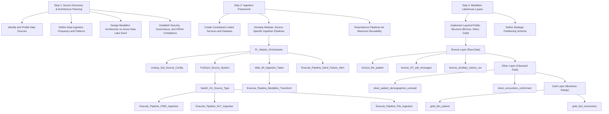

# EMR/EHR Integration System: Detailed Project Flow

---

### **STEP 1: Requirements & Architecture Planning**

This foundational phase is dedicated to establishing the strategic vision, technical framework, and governance policies for the entire project. It involves deep collaboration with clinical, operational, and IT stakeholders to ensure the final solution is aligned with business objectives and compliant with all regulatory mandates. Decisions made here have a cascading impact on every subsequent stage, from ingestion to analytics.



**Subtopics:**

- **Identify and Profile Data Sources**
This critical first step involves a comprehensive discovery and analysis of every data source to be integrated. For this project, we identified over 15 distinct sources across hospitals and clinics, which were categorized into three main types. The first category includes modern EMR systems exposing data via FHIR R4 APIs, requiring a deep understanding of RESTful protocols, OAuth 2.0 authentication, and the specific FHIR resource structures. The second category consists of legacy systems transmitting data as batch files of HL7 v2 messages via SFTP, which demands expertise in parsing complex, pipe-delimited text formats and understanding the nuances of different HL7 segments. The third category includes ancillary systems providing data as XML and CSV files, such as third-party lab results and financial claims data. Profiling each source involves documenting its schema, data volume, velocity, update frequency, and any existing data quality issues. This initial analysis directly informs the design of our ingestion pipelines and transformation logic, ensuring we build a system capable of handling the inherent diversity and complexity of healthcare data.
    
    **Key Data Entities and Fields Identified:**
    
    - **10 Key FHIR Resources (from modern EMRs):**
        1. `Patient`: `id`, `name.family`, `name.given`, `birthDate`, `gender`, `address.postalCode`, `telecom.value`.
        2. `Encounter`: `id`, `patient.reference`, `status`, `period.start`, `period.end`, `type.coding.code`.
        3. `Observation`: `id`, `subject.reference`, `code.coding.code`, `valueQuantity.value`, `valueQuantity.unit`, `effectiveDateTime`.
        4. `Condition`: `id`, `subject.reference`, `code.coding.code`, `onsetDateTime`.
        5. `Procedure`: `id`, `subject.reference`, `code.coding.code`, `performedPeriod.start`.
        6. `MedicationRequest`: `id`, `subject.reference`, `medicationCodeableConcept.coding.code`, `authoredOn`.
        7. `AllergyIntolerance`: `id`, `patient.reference`, `code.coding.code`, `recordedDate`.
        8. `DiagnosticReport`: `id`, `subject.reference`, `code.coding.code`, `conclusion`.
        9. `Practitioner`: `id`, `name.family`, `name.given`, `telecom.value`.
        10. `Organization`: `id`, `name`, `address.city`, `address.state`.
    - **10 Key HL7 Segments (from legacy systems):**
        1. `MSH`: `MSH-3` (Sending App), `MSH-7` (Message DateTime).
        2. `PID`: `PID-3` (Patient ID), `PID-5` (Patient Name), `PID-7` (DOB), `PID-8` (Gender), `PID-11` (Address).
        3. `PV1`: `PV1-2` (Patient Class), `PV1-19` (Visit Number), `PV1-44` (Admit DateTime).
        4. `OBR`: `OBR-4` (Universal Service ID).
        5. `OBX`: `OBX-3` (Observation ID), `OBX-5` (Observation Value), `OBX-11` (Result Status).
        6. `DG1`: `DG1-3` (Diagnosis Code).
        7. `AL1`: `AL1-3` (Allergy Code).
        8. `IN1`: `IN1-2` (Insurance Plan ID).
        9. `GT1`: `GT1-2` (Guarantor Name).
        10. `NK1`: `NK1-2` (Next of Kin Name).
    - **Key Ancillary Files (XML & CSV):**
        1. `LabCorp_Results.xml`: `//Patient/ID`, `//Test/Name`, `//Result/Value`, `//Result/Unit`.
        2. `Claims_Master.csv`: `ClaimID`, `PatientID`, `ProviderNPI`, `ServiceDate`, `CPT_Code`, `ICD10_Code`.
        3. `Provider_Directory.csv`: `ProviderNPI`, `ProviderLastName`, `Specialty`.
- **Define Data Ingestion Frequency and Patterns**
Based on the source profiling, we define specific ingestion strategies tailored to the capabilities and requirements of each system. This is not a one-size-fits-all approach. For FHIR APIs, we designed an incremental extraction pattern that leverages change tracking tokens or last-updated timestamps to pull only new or modified records, minimizing the load on source EMRs and enabling near-real-time data availability. For legacy HL7 systems, we implemented an event-based trigger mechanism. As soon as a new batch file is dropped onto the secure SFTP server, an Azure Data Factory trigger fires, initiating the ingestion process within minutes. For ancillary file-based sources, we configured scheduled batch extractions using tumbling windows to process data for specific time periods, ensuring complete and idempotent processing. This multi-pattern approach optimizes for timeliness, source system stability, and architectural efficiency.
- **Design the Medallion Architecture on Azure Data Lake Gen2**
The core of our storage and transformation strategy is the Medallion Architecture, implemented on Azure Data Lake Storage (ADLS) Gen2. We meticulously designed a three-layer logical structure to progressively refine data. The **Bronze Layer** serves as the raw, immutable landing zone. The **Silver Layer** is where the data is cleansed, conformed, and integrated. The **Gold Layer** contains the final, business-ready data, aggregated and modeled for analytics. This layered approach provides clear separation of concerns, enhances data quality, and supports a wide range of use cases from data science to executive reporting.
    
    **20 Key Delta Tables Across Layers:**
    
    - **Bronze Tables (Raw & Immutable):** `bronze_fhir_patient`, `bronze_fhir_encounter`, `bronze_fhir_observation`, `bronze_fhir_condition`, `bronze_hl7_adt_messages`, `bronze_hl7_orm_messages`, `bronze_hl7_oru_messages`, `bronze_ancillary_claims_csv`, `bronze_ancillary_provider_dir_csv`, `bronze_ancillary_labcorp_xml`.
    - **Silver Tables (Cleansed & Conformed):** `silver_patient_demographics_unioned`, `silver_patient_master_index`, `silver_encounters_conformed`, `silver_lab_results_harmonized`, `silver_diagnoses_harmonized`.
    - **Gold Tables (Aggregated & Business-Ready):** `gold_dim_patient`, `gold_dim_provider`, `gold_dim_location`, `gold_dim_date`, `gold_fact_encounters`.
- **Establish Security, Governance, and HIPAA Compliance Framework**
From day one, security and HIPAA compliance were designed into the architecture, not added as an afterthought. We established a multi-layered security framework to protect sensitive Protected Health Information (PHI). This began with defining a strict Role-Based Access Control (RBAC) model using Azure Active Directory (AAD) groups. Permissions are assigned at the most granular level possible. All sensitive credentials, such as API keys and SFTP passwords, are stored securely in Azure Key Vault, accessed at runtime by services using Managed Identities to eliminate secrets in code. To meet HIPAA's stringent auditing requirements, we enabled comprehensive diagnostic logging for all Azure services, funneling all access and activity logs into a central Azure Log Analytics workspace. This creates an immutable audit trail of every action performed on the data. Dynamic Data Masking and Column-Level Security are implemented in the serving layer to further restrict exposure of PII.

---

### **STEP 2: Data Ingestion Using Azure Data Factory (ADF)**

This stage focuses on the implementation of robust, scalable, and auditable data pipelines in Azure Data Factory to move raw data from its diverse sources into the Bronze layer of our data lake. The design prioritizes modularity, reusability, and operational resilience.

**Subtopics:**

- **Create Centralized Linked Services and Datasets**
The foundation of any ADF pipeline is the configuration of Linked Services and Datasets. We adopted a centralized and secure approach. For each of the 15+ source systems and our ADLS Gen2 sink, we created a dedicated Linked Service. A critical aspect of this setup was the integration with Azure Key Vault. Instead of storing connection strings, API keys, or passwords directly in ADF, we stored them as secrets in Key Vault. The Linked Services were then configured to retrieve these credentials at runtime using the ADF's Managed Identity, adhering to a "no secrets in code" security posture. Following this, we defined Datasets for each data entity (e.g., a FHIR Patient resource, an HL7 ADT message file, a CSV claims file). These datasets act as strongly-typed pointers to the data, defining its location, format, and schema.
- **Develop Modular, Source-Specific Ingestion Pipelines**
To manage the complexity of multiple sources, I designed a master orchestration pipeline that calls dedicated child pipelines for each source type, promoting modularity and independent maintenance. The **FHIR API Pipeline** uses a Web Activity to perform OAuth 2.0 authentication, a Lookup activity to fetch the list of FHIR resources to ingest, and a ForEach loop that executes a Copy Data activity for each resource, handling API pagination automatically. The **HL7 SFTP Pipeline** is event-triggered, using Get Metadata to validate files, Copy Data to transfer, and Delete to archive. The **Ancillary File Pipeline** uses dynamic content and parameters to manage various XML and CSV files. This modular design allows us to add new hospitals or data sources with minimal effort.
- **Parameterize Pipelines for Maximum Reusability**
A core design principle was to avoid hardcoding any values within the pipelines to ensure they were reusable across environments (Dev, Test, Prod) and scalable to new sources. Every critical piece of information was converted into a parameter (e.g., API base URLs, SFTP folder paths, Key Vault secret names). We stored these configuration values in a central Azure SQL control table, which the master orchestrator reads at the start of its run. This approach dramatically reduced development time and simplified management. Instead of maintaining 15 slightly different pipelines, we maintain a small set of robust, parameterized pipelines and manage their execution through a configuration table.

### **Detailed Azure Data Factory Pipeline Implementation**

**Parent Pipeline: `PL_Master_Orchestrator`**
This is the main control-flow pipeline, triggered on a schedule. It coordinates all ingestion and transformation processes.

- **Activities:**
    1. **`Lookup_Get_Source_Config`**: Reads a control table from Azure SQL DB to get a list of active sources to process, along with their types (FHIR, HL7, etc.), connection parameters, and entity lists.
    2. **`ForEach_Source_System` (Parallel)**: Iterates through each source system returned by the lookup activity, allowing for parallel processing of different hospitals.
    3. **Inside `ForEach` -> `Switch_On_Source_Type`**: A Switch activity that directs the flow based on the `SourceType` column from the control table.
        - **Case 'FHIR'**:
        4. **`Execute_Pipeline_FHIR_Ingestion`**: Calls the `PL_Ingest_FHIR_API` child pipeline, passing parameters like BaseURL, ResourceList, and KeyVault secret names for credentials.
        - **Case 'HL7_SFTP'**:
        5. **`Execute_Pipeline_HL7_Ingestion`**: Calls the `PL_Ingest_HL7_SFTP` child pipeline with parameters for the SFTP server, folder path, and file pattern.
        - **Case 'Ancillary_File'**:
        6. **`Execute_Pipeline_File_Ingestion`**: Calls the `PL_Ingest_Ancillary_Files` child pipeline.
    4. **`Wait_All_Ingestion_Tasks`**: A Wait activity that depends on the `ForEach` loop to ensure all ingestion activities complete before proceeding to the transformation stage.
    5. **`Execute_Pipeline_Medallion_Transform`**: After all ingestion is successful, this activity calls the `PL_Orchestrate_Synapse_Transforms` pipeline to start the data processing in Synapse Spark.
    6. **`Stored_Procedure_Log_Master_Success`**: On success of the entire flow, this executes a stored procedure to log the completion status and runtime in a monitoring table.
    7. **`Execute_Pipeline_Send_Failure_Alert` (On Failure)**: Attached to the main activities, this calls a generic notification pipeline if any part of the master orchestration fails, sending an email via a Logic App.

**Child Pipeline: `PL_Ingest_FHIR_API`**
Handles the complex logic of authenticating, fetching, and paginating through FHIR API resources.

- **Activities:**
11. **`Web_Get_OAuth_Token`**: Makes an HTTP POST request to the EMR's OAuth 2.0 endpoint. Client ID and Secret are pulled securely from Azure Key Vault.
12. **`Set_Variable_AuthHeader`**: Stores the retrieved bearer token in a pipeline variable, formatted as 'Bearer {token}'.
13. **`ForEach_FHIR_Resource`**: Iterates through a list of resources passed as a parameter (e.g., ['Patient', 'Encounter', 'Observation']).
14. **Inside `ForEach` -> `Until_Pagination`**: An Until loop to handle paginated API responses. It continues as long as a 'nextLink' variable is not empty.
15. **Inside `Until` -> `Copy_Data_FHIR_Resource`**: The core activity. Uses a REST source to call the FHIR API (with the dynamic URL from the loop and the auth header) and a JSON sink to write the response bundle to the ADLS Bronze layer.
16. **Inside `Until` -> `Set_Variable_NextLink`**: After the copy, this activity parses the output of the Copy activity to find the `link.next.url` value in the JSON response and updates the 'nextLink' variable for the next iteration of the loop.

**Child Pipeline: `PL_Orchestrate_Synapse_Transforms`**
Coordinates the execution of Synapse Spark notebooks in the correct order.

- **Activities:**
17. **`Notebook_Bronze_to_Silver`**: Executes the first Synapse notebook that parses raw files and produces the conformed Silver tables. It waits for completion.
18. **`Notebook_Silver_PMI`**: Depends on the success of the previous step. Executes the Patient Master Indexing notebook.
19. **`Notebook_Silver_to_Gold`**: Depends on the success of the PMI. Executes the final notebook that builds the Gold layer star schema models.
20. **`Stored_Procedure_Update_SQL_Pool_Stats`**: After Gold tables are refreshed, this activity calls a stored procedure in the Synapse Dedicated SQL Pool to update statistics on the newly loaded tables, ensuring optimal query performance.
21. **`Web_Hook_Notify_BI_Team`**: Sends a notification to a Microsoft Teams channel via a webhook to inform the BI team that fresh data is available for reporting.

---

### **STEP 3: Data Storage in Azure Data Lake**

This phase covers the physical and logical organization of data within Azure Data Lake Storage Gen2. A well-defined storage strategy is crucial for performance, governance, and ease of use.

**Subtopics:**

- **Implement Layered Folder Structure (Bronze, Silver, Gold)**
    
    The Medallion Architecture's logical layers are physically manifested as a structured folder hierarchy within ADLS Gen2. The top-level containers are named bronze, silver, and gold. Within the bronze container, we created a folder for each source system (e.g., emr_hospital_a, sftp_legacy_system_b), and within those, a folder for each data entity (e.g., patient, encounter). This ensures a clean separation of raw data and preserves its original context. The silver container is organized by conformed business entities (e.g., patient_master, clinical_events), reflecting the integrated nature of the data at this stage. Finally, the gold container holds our analytics-ready models, with folders for dimensions (dim_patient, dim_provider) and facts (fact_encounters). This clear, hierarchical structure is self-documenting, simplifies access control, and makes it intuitive for developers and analysts to locate the data they need at the appropriate level of refinement.
    
- **Define a Strategic Partitioning Scheme**
    
    To ensure high-performance queries in the downstream transformation stage, we implemented a strategic partitioning scheme for all our Delta tables stored in the lake. Data in each layer is physically partitioned into subfolders based on key attributes. For instance, in the Bronze and Silver layers, data is almost always partitioned by ingestion_date (e.g., year=2024/month=02/day=28). This is incredibly effective for incremental processing, as Spark can use "partition pruning" to read only the folders corresponding to the new data, avoiding a costly full table scan. In the Gold layer, fact tables are often partitioned by a relevant business date, like EncounterDateKey. For massive tables like Fact_LabResults, we might use a composite partitioning scheme, such as by source_system and then by date, to further optimize queries that filter on a specific hospital. This physical layout of data on disk is one of the most important performance tuning techniques in a big data ecosystem.
    

---

---

### **STEP 4: Data Transformation Using Azure Synapse Spark**

This is the core "Transform" stage of our ELT architecture, where the raw data landed in the Bronze layer is progressively refined, enriched, and modeled for analytics using the power of Apache Spark within Azure Synapse.

**Subtopics:**

- **Bronze to Silver: Cleansing, Harmonization, and Conforming**
This is the most intensive transformation stage. For FHIR JSON and ancillary XML, we use Spark's built-in functions combined with `explode` to flatten nested structures. For HL7 messages, a specialized library is used to parse segments. We then apply rigorous data quality rules and harmonize data using enterprise mapping tables to convert proprietary codes to industry standards like LOINC, SNOMED CT, and ICD-10.
    
    **PySpark Code Example: Processing FHIR Patient and Observation Data**
    
    ```python
    from pyspark.sql.functions import col, from_json, to_date, lit, explode, input_file_name, first
    from pyspark.sql.types import StructType, StructField, StringType, ArrayType, DateType
    
    # Define a schema to parse the nested JSON structure of a FHIR Patient resource
    patient_schema = StructType([
        StructField("id", StringType(), True),
        StructField("name", ArrayType(StructType([
            StructField("family", StringType(), True),
            StructField("given", ArrayType(StringType()), True)
        ])), True),
        StructField("birthDate", StringType(), True),
        StructField("gender", StringType(), True),
        StructField("address", ArrayType(StructType([
            StructField("postalCode", StringType(), True)
        ])), True)
    ])
    
    # --- 1. Read Raw Patient Data and Transform to Silver ---
    bronze_patient_df = spark.read.format("delta").load("/bronze/bronze_fhir_patient/")
    silver_patient_df = bronze_patient_df.withColumn("patient_data", from_json(col("raw_json_payload"), patient_schema)) \\
        .select(
            col("patient_data.id").alias("patient_source_id"),
            col("patient_data.name")[0].getItem("family").alias("last_name"),
            col("patient_data.name")[0].getItem("given")[0].alias("first_name"),
            to_date(col("patient_data.birthDate"), "yyyy-MM-dd").alias("date_of_birth"),
            col("patient_data.gender").alias("gender"),
            col("patient_data.address")[0].getItem("postalCode").alias("postal_code"),
            col("source_system_id"),
            col("ingestion_timestamp")
        )
    silver_patient_df.write.format("delta").mode("append").save("/silver/silver_patient_demographics_unioned/")
    print(f"Processed and appended {silver_patient_df.count()} patient records to the Silver layer.")
    
    # --- 2. Read Raw Observation Data and Harmonize to Silver ---
    bronze_observation_df = spark.read.format("delta").load("/bronze/bronze_fhir_observation/")
    loinc_map_df = spark.read.format("delta").load("/maps/enterprise_loinc_mapping/")
    silver_lab_results_df = bronze_observation_df.withColumn("obs_data", from_json(col("raw_json_payload"), observation_schema)) \\
        .select(explode(col("obs_data.entry")).alias("entry")) \\
        .select(
            col("entry.resource.subject.reference").alias("patient_source_reference"),
            col("entry.resource.code.coding")[0].getItem("code").alias("source_lab_code"),
            col("entry.resource.valueQuantity.value").cast("decimal(18,4)").alias("result_numeric_value"),
            col("entry.resource.valueQuantity.unit").alias("result_unit"),
            to_date(col("entry.resource.effectiveDateTime")).alias("result_date")
        ).join(loinc_map_df, col("source_lab_code") == loinc_map_df.source_lab_code, "left")
    silver_lab_results_df.write.format("delta").mode("append").save("/silver/silver_lab_results_harmonized/")
    print(f"Processed and appended {silver_lab_results_df.count()} lab results to the Silver layer.")
    
    ```
    
- **Implementing the Patient Master Index (PMI) for a 360-Degree View**
The cornerstone of creating a unified patient view is the Patient Master Index (PMI) process, which I designed and implemented in Synapse Spark. This multi-step algorithm resolves patient identities across all systems. 1. Standardization: PII fields are rigorously cleaned. 2. Phonetic Encoding: I applied phonetic algorithms like Soundex. 3. Blocking: To make the matching process computationally feasible, I used a blocking strategy. 4. Probabilistic Scoring: Within each block, pairs of records were compared and scored. 5. Master Record Creation: A graph-based algorithm connected matching pairs to form clusters, and a single `MasterPatientID` was generated for each cluster.
    
    **PySpark Code Example: Patient Master Index (PMI) Implementation**
    
    ```python
    from pyspark.sql.functions import col, soundex, lower, regexp_replace, when, broadcast, concat, first
    
    # 1. Read cleansed patient data from the Silver layer
    patient_data_df = spark.read.format("delta").load("/silver/silver_patient_demographics_unioned/")
    # 2. Apply Standardization and Phonetic Encoding
    standardized_df = patient_data_df \\
        .withColumn("std_first_name", lower(regexp_replace(col("first_name"), "[^a-zA-Z]", ""))) \\
        .withColumn("std_last_name", lower(regexp_replace(col("last_name"), "[^a-zA-Z]", ""))) \\
        .withColumn("soundex_last_name", soundex(col("std_last_name")))
    # 3. Create a Blocking Key
    blocked_df = standardized_df.withColumn("blocking_key", concat(col("postal_code").substr(1, 3), col("soundex_last_name")))
    # 4. Probabilistic Scoring via Self-Join within Blocks
    patient_a = blocked_df.alias("a")
    patient_b = blocked_df.alias("b")
    paired_df = patient_a.join(patient_b, (col("a.blocking_key") == col("b.blocking_key")) & (col("a.patient_source_id") < col("b.patient_source_id"))) \\
        .withColumn("match_score",
            (when(col("a.std_last_name") == col("b.std_last_name"), 50).otherwise(0)) +
            (when(col("a.std_first_name") == col("b.std_first_name"), 30).otherwise(0)) +
            (when(col("a.date_of_birth") == col("b.date_of_birth"), 20).otherwise(0))
        )
    # 5. Master Record Creation (using a graph algorithm function)
    pmi_mapping_df = create_master_id_from_graph(paired_df.filter(col("match_score") > 85))
    pmi_mapping_df.write.format("delta").mode("overwrite").save("/silver/silver_patient_master_index/")
    print("Patient Master Index mapping table has been created.")
    
    ```
    
- **Silver to Gold: Aggregation and Star Schema Modeling**
The final transformation stage focuses on preparing the data for high-performance analytics. A set of Spark notebooks reads from the clean Silver tables to create aggregated, business-centric data models. The primary goal here is to create a classic star schema that is intuitive for business users and optimized for BI tools. This stage involves generating surrogate keys and strategically denormalizing the data to minimize complex joins at query time.
    
    **PySpark Code Example: Building Gold Dimension and Fact Tables**
    
    ```python
    from pyspark.sql.functions import monotonically_increasing_id, col, first
    
    # --- 1. Build Gold Dimension Table: gold_dim_patient ---
    patient_data_df = spark.read.format("delta").load("/silver/silver_patient_demographics_unioned/")
    pmi_mapping_df = spark.read.format("delta").load("/silver/silver_patient_master_index/")
    patient_with_master_id_df = patient_data_df.join(pmi_mapping_df, ["patient_source_id"], "inner")
    dim_patient_df = patient_with_master_id_df.groupBy("MasterPatientID").agg(
            first("first_name", ignorenulls=True).alias("FirstName"),
            first("last_name", ignorenulls=True).alias("LastName"),
            first("date_of_birth", ignorenulls=True).alias("DateOfBirth"),
            first("gender", ignorenulls=True).alias("Gender"),
            first("postal_code", ignorenulls=True).alias("PostalCode")
        ).withColumn("PatientKey", monotonically_increasing_id())
    dim_patient_df.write.format("delta").mode("overwrite").save("/gold/gold_dim_patient/")
    print(f"Built and wrote gold_dim_patient with {dim_patient_df.count()} records.")
    
    # --- 2. Build Gold Fact Table: gold_fact_encounters ---
    silver_encounters_df = spark.read.format("delta").load("/silver/silver_encounters_conformed/")
    dim_patient_df_keys = spark.read.format("delta").load("/gold/gold_dim_patient/").select("MasterPatientID", "PatientKey")
    dim_provider_df_keys = spark.read.format("delta").load("/gold/gold_dim_provider/").select("ProviderNPI", "ProviderKey")
    dim_date_df_keys = spark.read.format("delta").load("/gold/gold_dim_date/").select("Date", "DateKey")
    fact_encounters_df = silver_encounters_df \\
        .join(broadcast(dim_patient_df_keys), ["MasterPatientID"], "inner") \\
        .join(broadcast(dim_provider_df_keys), ["ProviderNPI"], "inner") \\
        .join(dim_date_df_keys, silver_encounters_df.EncounterDate == dim_date_df_keys.Date, "inner") \\
        .select(
            col("PatientKey"), col("ProviderKey"), col("DateKey").alias("EncounterDateKey"),
            col("EncounterID"), col("TotalBilledAmount"), col("LengthOfStayDays")
        )
    fact_encounters_df.write.format("delta").mode("overwrite").partitionBy("EncounterDateKey").save("/gold/gold_fact_encounters/")
    print(f"Built and wrote gold_fact_encounters with {fact_encounters_df.count()} records.")
    
    ```
    
- **Leveraging Delta Lake for ACID Transactions and Time Travel**
Throughout the transformation process, every table in every layer (Bronze, Silver, and Gold) is stored in the Delta Lake format. This deliberate architectural choice provides several critical capabilities: **ACID transactions** to guarantee data integrity; **Schema Enforcement** to act as a powerful quality gate; and **Time Travel** to query any previous version of the data, which is invaluable for auditing, debugging, and rollbacks. These features elevate our data lake from a simple file repository to a reliable, enterprise-grade data warehouse.

---

### **STEP 5: Orchestration & Integration**

This phase focuses on how Azure Data Factory is used not just for ingestion, but as the master conductor for the entire end-to-end workflow, ensuring that all steps execute in the correct sequence with proper dependency management and error handling.

**Subtopics:**

- **End-to-End Workflow Orchestration in ADF**
    
    Our master ADF pipeline, the EMR_EHR_Master_Orchestrator, serves as the central brain of the entire system. The workflow begins by triggering the parallel ingestion child pipelines. Upon their successful completion, it proceeds to the transformation stage. It uses a "Synapse Notebook" activity to trigger the Bronze-to-Silver Spark notebooks. A dependency is configured so that the Silver-to-Gold notebooks only begin after the Silver processing has successfully finished. Finally, after the Gold tables are built, it triggers a final pipeline that loads the data into the Synapse Dedicated SQL Pool for enterprise reporting. This chained, sequential execution ensures data flows logically through the Medallion layers and that upstream dependencies are always met.
    
- **Managing Dependencies and Conditional Execution Paths**
    
    A robust pipeline is not just about a successful run; it's about how it handles failures. We made extensive use of ADF's dependency management features. Each activity in the master orchestrator is linked to the next using "On Success" precedence constraints. This ensures, for example, that the transformation notebooks will not even attempt to run if any of the initial ingestion pipelines fail. Furthermore, we implemented conditional failure paths. An "On Failure" dependency was added to critical activities, which triggers a separate pipeline to send an alert notification to the support team via email or Microsoft Teams. We also use "If Condition" activities to add more complex logic, such as checking if any files were actually ingested before launching a computationally expensive Spark job, thus saving on costs.
    

---

### **STEP 6: Data Validation and Quality Checks**

This crucial phase details the specific processes and embedded checks designed to ensure the accuracy, completeness, and integrity of the data as it moves through the platform.

**Subtopics:**

- **Implementing Data Quality Rules in Spark**
    
    Data quality is enforced primarily within the Bronze-to-Silver transformation notebooks. We developed a library of custom data quality functions in PySpark that are applied to every batch of data. These checks include: **Completeness Checks** (flagging records where critical fields like Patient ID or Encounter Date are null), **Format Validation** (using regex to ensure fields like postal codes match expected patterns), **Range Checks** (validating that numeric values fall within a logical range, e.g., lab results), and **Uniqueness Checks** (identifying duplicate records). Records that fail these validation rules are not discarded. Instead, they are flagged with a specific error code and routed to a separate quarantine or "dead-letter" table. This allows data stewards to review the issues without halting the entire data pipeline.
    

---

### **STEP 7: Load to Analytics Layer or BI Tools**

This stage focuses on making the curated Gold-layer data available to end-users in a high-performance, secure, and user-friendly manner.

**Subtopics:**

- **Designing and Loading the Synapse SQL Pool Star Schema**
    
    For enterprise-grade analytics requiring sub-second response times, we provisioned a Synapse Analytics Dedicated SQL Pool. The Gold Delta tables were used to populate a classic star schema. To optimize performance, we used a HASH distribution on the PatientKey for large fact tables, co-locating a patient's data on the same compute node. Smaller dimension tables were set to REPLICATED to avoid data movement. All tables were created with CLUSTERED COLUMNSTORE INDEXES for maximum compression and scan performance. The loading process was orchestrated by ADF, using the highly efficient COPY INTO command to bulk-load data directly from the Gold ADLS folders.
    
- **Enabling Power BI with Direct Lake and SQL Connectivity**
    
    We provided two primary consumption patterns for Power BI. For the most up-to-the-minute analytics, we utilized Power BI's **Direct Lake** mode. This allows Power BI to connect directly to the Gold Delta tables in ADLS Gen2, bypassing the need to import or query a separate database, which is ideal for operational dashboards. For more structured, enterprise-wide reporting, Power BI dashboards were connected to the **Synapse Dedicated SQL Pool**. This provides extremely high performance for complex queries and aggregations due to the pre-built star schema and SQL Pool's massively parallel processing engine. This dual approach gives the organization flexibility to choose between the absolute latest data or the highest-performance curated data.
    

---

### **STEP 8: Monitoring, Logging & Cost Optimization**

This continuous process involves implementing tools and strategies to ensure the platform is healthy, performant, auditable, and cost-effective.

**Subtopics:**

- **Centralized Monitoring and Alerting with Azure Monitor**
    
    We implemented a comprehensive monitoring solution by integrating all platform components with Azure Monitor. Diagnostic logs from ADF, Synapse Spark, Synapse SQL Pool, and ADLS were configured to stream into a single Log Analytics workspace. We then built custom dashboards in Azure Monitor to visualize key metrics in real-time: pipeline success/failure rates, duration of Spark jobs, and SQL Pool utilization. Crucially, we configured alerts based on this data. For example, an alert is automatically triggered if an ADF pipeline fails or if a Spark job runs longer than its expected SLA. This proactive monitoring allows us to detect and resolve issues before they impact business users.
    
- **Implementing Proactive Cost Optimization Strategies**
    
    Managing cloud costs was a key priority. In Synapse Spark, clusters were configured to **auto-terminate** after a short period of inactivity. For the Synapse Dedicated SQL Pool, we implemented an **auto-scaling and auto-pausing** schedule, scaling up during business hours and pausing overnight and on weekends to eliminate compute costs. For ad-hoc queries, we encouraged users to leverage the Synapse **Serverless SQL Pool**, which operates on a pay-per-query model. Finally, we configured **Data Lifecycle Management** policies on ADLS Gen2 to automatically move older raw data from the Bronze layer to a cheaper, cooler storage tier.
