# Nikhil Project  1

# Data Ingestion and Processing: A Comprehensive Architecture for Retail Analytics

In today's data-driven retail landscape, establishing a robust and scalable data architecture is crucial for businesses to maintain their competitive edge. This comprehensive guide explores the implementation of a modern data platform that processes both batch and streaming data, transforming raw retail data into actionable insights through a multi-layered approach.

## Understanding the Data Landscape

The retail industry generates vast amounts of data from various sources, including point-of-sale systems, inventory management, customer interactions, and online transactions. Managing this diverse data ecosystem requires a sophisticated approach that can handle both traditional batch processing and real-time streaming data.

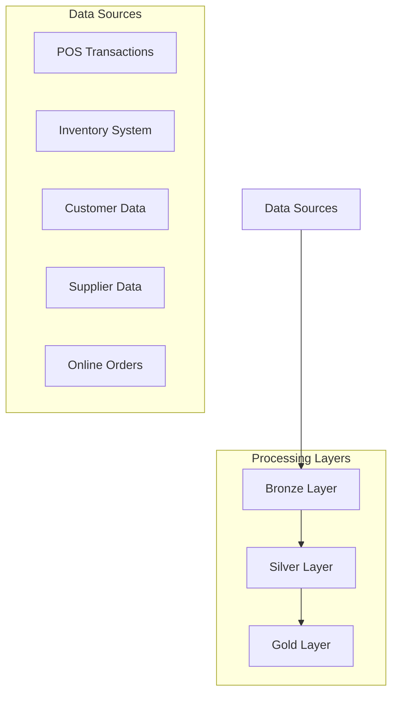

## Data Sources and Their Characteristics

Each data source in our retail ecosystem serves a specific purpose and comes with its unique characteristics and challenges:

1. POS Transactions: These form the backbone of retail operations, capturing every sale, return, and payment method. The data is typically structured and arrives in regular intervals from multiple store locations. SQL Server and MySQL databases commonly store this transactional data, requiring reliable extraction methods to ensure data consistency.
2. Inventory Management System: This critical component tracks stock levels, product movement, and warehouse operations. Oracle and PostgreSQL databases often manage this data, which needs regular synchronization to maintain accurate stock levels and prevent stockouts or overstock situations.

## Data Ingestion Architecture

The data ingestion process is designed to handle both batch and streaming data efficiently:

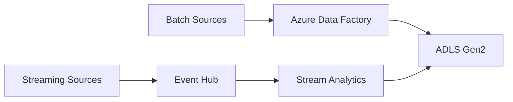

### Batch Ingestion Process

Azure Data Factory (ADF) serves as the primary orchestration tool for batch data ingestion. It provides several advantages:

- Robust connectivity to various data sources
 Built-in scheduling and monitoring capabilities
 Error handling and retry mechanisms
 Scalability to handle growing data volumes
 Integration with other Azure services

### Streaming Data Processing

The streaming architecture handles real-time data processing through Azure Event Hub and Stream Analytics. This setup enables:

- Real-time data capture from online transactions
 Immediate processing of customer interactions
 Quick response to inventory changes
 Real-time analytics for business decisions

## Bronze Layer Implementation

The Bronze layer, also known as the raw layer, serves as the initial landing zone for all incoming data. Its primary purpose is to preserve the original data in its unaltered form, creating a historical record that can be referenced or reprocessed if needed.

Key aspects of the Bronze layer implementation include:

1. Data Organization: Raw data is organized in a hierarchical folder structure within ADLS Gen2, following patterns like:

```
/bronze
    /pos_transactions
        /yyyy/mm/dd/file.parquet
    /inventory
        /yyyy/mm/dd/file.parquet
    /customer_data
        /yyyy/mm/dd/file.json

```

1. File Formats: Data is stored in optimal formats:
• Structured data: Parquet format for efficient storage and query performance
• Semi-structured data: JSON for flexibility
• Unstructured data: Binary format with metadata

### Azure Data Factory Pipeline Architecture

The complete data movement process in Azure Data Factory involves multiple interconnected pipelines and activities designed to handle various data sources efficiently.

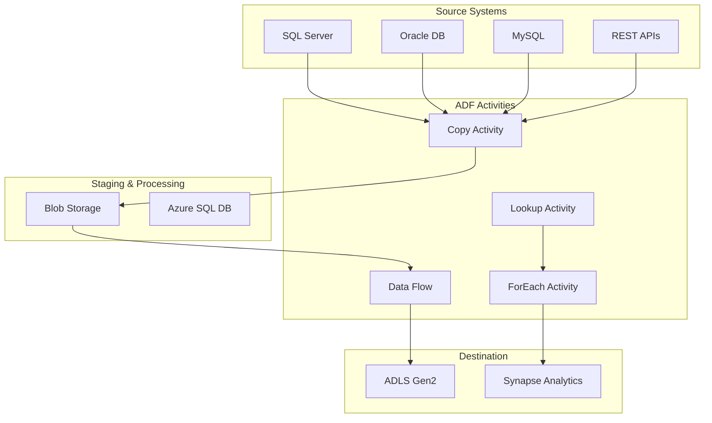

### Multi-Table Data Movement Strategy

For handling multiple tables, we implement a metadata-driven approach:

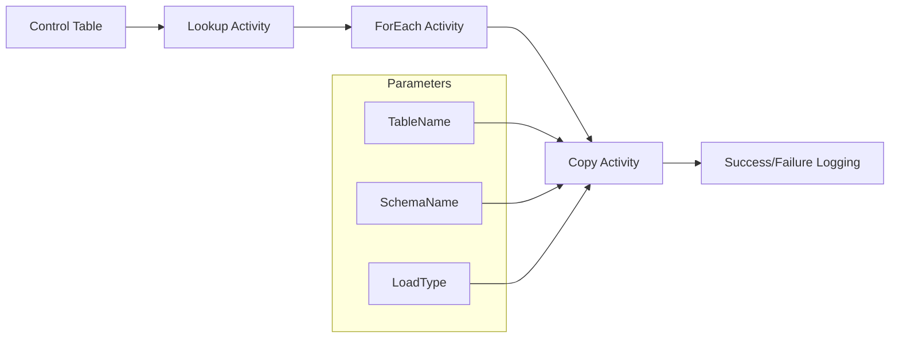

### Pipeline Components

1. **Control Table Setup:** Maintain a control table in Azure SQL Database that contains metadata about source tables:
• Table name and schema
• Source and destination connections
• Watermark columns for incremental loads
• Load frequency and type
2. **Dynamic Pipeline Configuration:** Implement parameterized pipelines that can:
• Read configuration from control tables
• Handle different table structures
• Apply appropriate data type mappings
• Execute appropriate validation rules

```sql
CREATE TABLE [dbo].[TableConfig] (
    TableId INT IDENTITY(1,1),
    SchemaName VARCHAR(50),
    TableName VARCHAR(100),
    WatermarkColumn VARCHAR(50),
    LoadType VARCHAR(20),
    SourceConnection VARCHAR(100),
    DestinationPath VARCHAR(200),
    IsActive BIT
)

```

### Error Handling and Monitoring

Implement robust error handling and monitoring mechanisms:

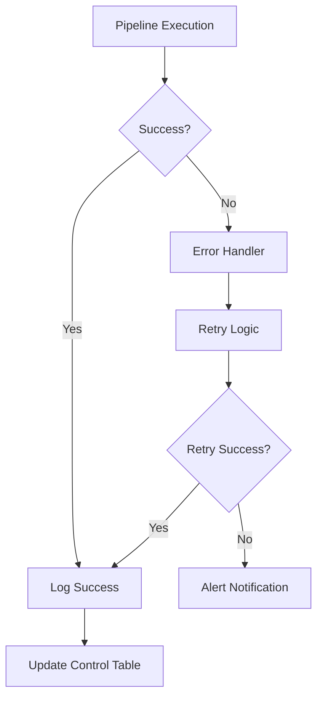

### Monitoring and Logging Framework

- Pipeline execution metrics tracking
- Data quality validation results
- Performance monitoring and optimization
- Custom alerting based on business rules

This comprehensive pipeline architecture ensures efficient, reliable, and scalable data movement while maintaining full visibility and control over the entire process.

## Silver Layer: Data Cleaning and Transformation

The Silver layer represents a crucial phase in our data processing pipeline where raw data undergoes thorough cleaning and transformation. This intermediate layer bridges the gap between raw data and business-ready analytics, ensuring data quality and consistency across all downstream applications.

### Data Processing Framework

Azure Databricks serves as our primary processing engine, leveraging PySpark for distributed data processing. The framework is designed to handle large-scale data transformation while maintaining data lineage and ensuring reproducibility.

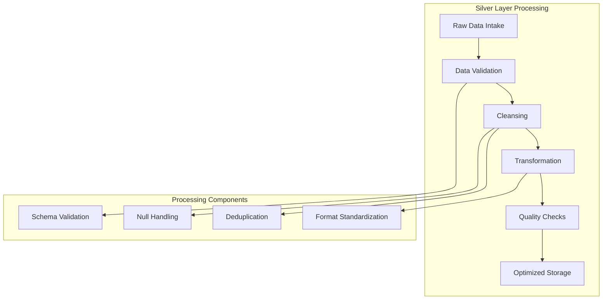

The data processing framework implements sophisticated cleansing routines that handle various data quality issues such as missing values, inconsistent formats, and duplicate records. Each transformation is logged and monitored to ensure data quality and processing efficiency.

### Schema Evolution Management

One of the key challenges in data processing is managing schema evolution. Our architecture employs Azure Databricks Auto Loader to handle schema changes gracefully, ensuring continuous data processing even when source systems evolve.

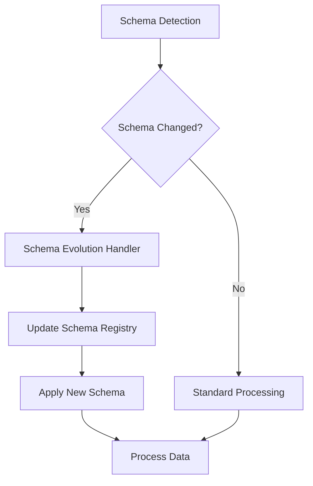

## Gold Layer: Advanced Analytics and Business Intelligence

The Gold layer represents the final stage of our data processing pipeline, where cleaned and transformed data is converted into business-ready datasets. This layer focuses on creating denormalized, query-optimized data structures that directly serve business intelligence and analytical needs.

### Analytical Model Implementation

The analytical models in the Gold layer are designed to support various business requirements, from operational reporting to advanced analytics. These models are implemented using a combination of Databricks processing and Azure Synapse Analytics.

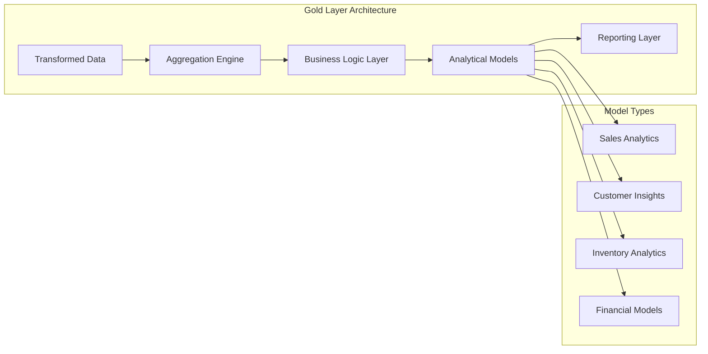

The Gold layer implements a comprehensive star schema design that optimizes query performance while maintaining data relationships. This design is particularly crucial for supporting complex analytical queries and reporting requirements.

### Performance Optimization Strategies

To ensure optimal performance in the Gold layer, we implement various optimization strategies including partitioning, clustering, and materialized views. These strategies are crucial for maintaining quick query response times even as data volumes grow.

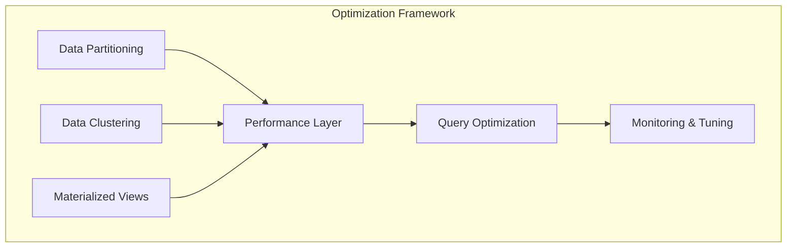

The optimization framework continuously monitors query patterns and automatically adjusts the physical data organization to maintain optimal performance. This includes regular maintenance of statistics, partition management, and automated view refreshes.

### Data Delivery and Consumption

The final stage of our architecture focuses on making the processed data available to various business users and applications. This includes both direct access through SQL interfaces and API-based data services.

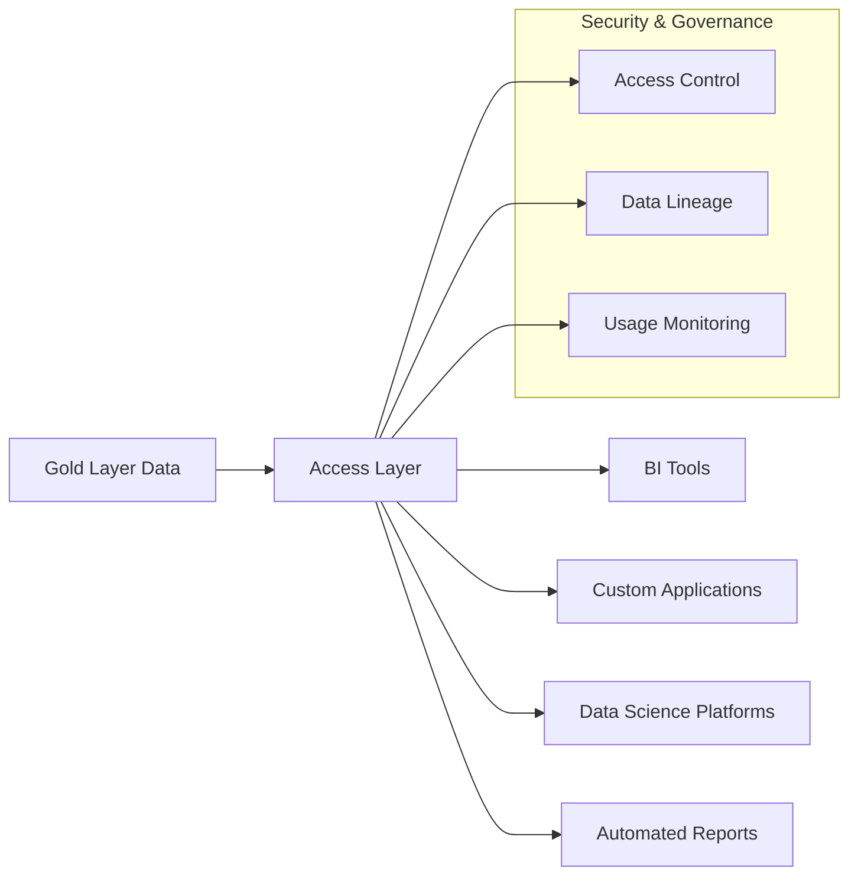

The data delivery framework ensures secure and efficient access to business-ready data while maintaining governance and compliance requirements. This includes comprehensive auditing, access control, and usage monitoring capabilities.

## Monitoring and Maintenance

A robust monitoring and maintenance framework is essential for ensuring the reliability and performance of the entire data platform. This framework provides real-time visibility into data processing operations and automates routine maintenance tasks.

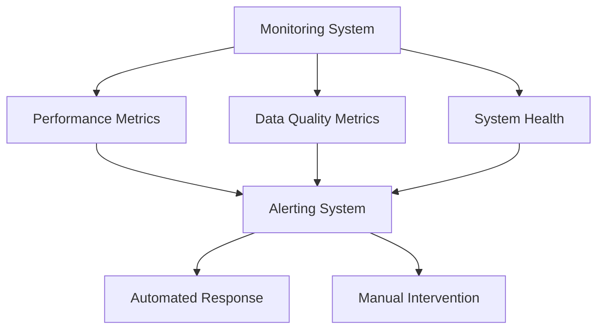

The monitoring framework provides comprehensive coverage across all layers of the architecture, ensuring early detection of potential issues and maintaining optimal system performance. This includes automated alerting and response mechanisms for common operational scenarios.

## Real-time Analytics and Visualization Layer

The final component of our architecture implements real-time analytics and visualization capabilities, enabling immediate insights from streaming data and processed analytics.

### Data Serving Architecture

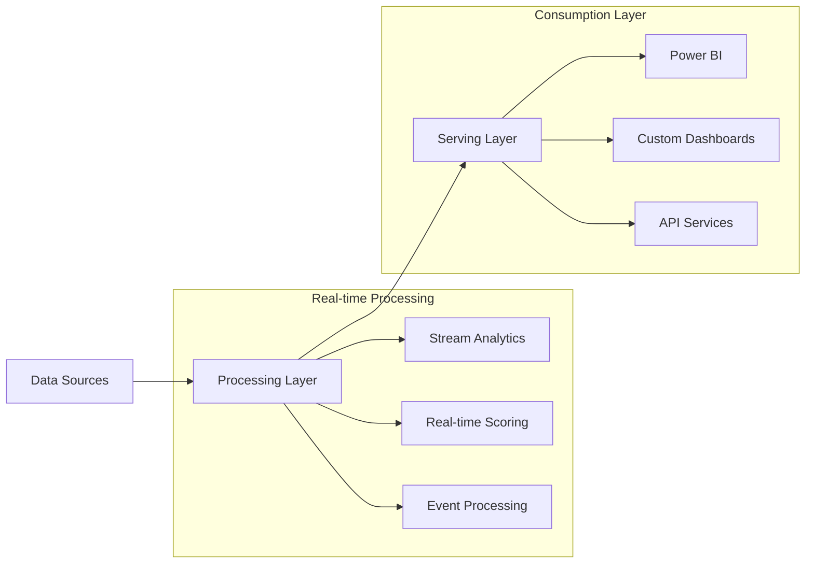

### Business Intelligence Implementation

The BI layer leverages Azure Synapse Analytics and Power BI to deliver actionable insights through interactive dashboards and reports.

1. **Sales Performance Analytics:**Real-time sales tracking
 Revenue forecasting
 Product performance metrics
 Geographic sales distribution
2. **Customer Analytics:**Customer segmentation
 Buying pattern analysis
 Churn prediction
 Customer lifetime value calculation
3. **Inventory Analytics:**Stock level monitoring
 Demand forecasting
 Supplier performance metrics
 Reorder point optimization

### Monitoring and Alerting Framework

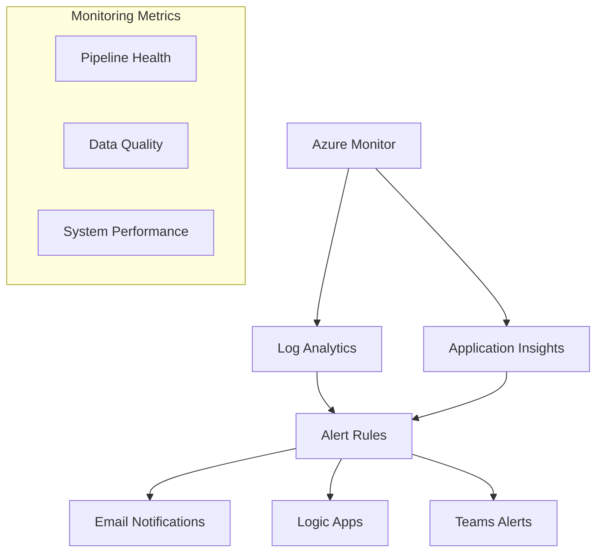

The monitoring framework provides comprehensive oversight of the entire data platform, ensuring optimal performance and reliability through automated alerting and response mechanisms.

### Automated Failure Handling

1. **Pipeline Monitoring:**Real-time pipeline status tracking
 Automated retry mechanisms
 Failure notification system
 Error logging and analysis
2. **Data Quality Monitoring:**Data completeness checks
 Accuracy validation
 Consistency verification
 Schema compliance monitoring

This comprehensive monitoring and analytics framework ensures that business users have access to reliable, real-time insights while maintaining system health and data quality.
