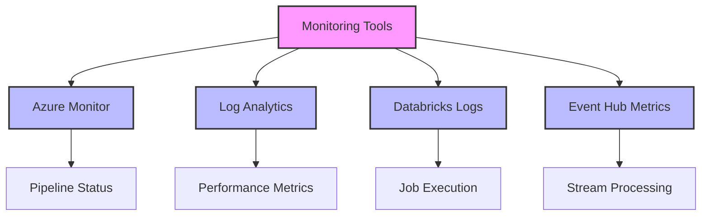
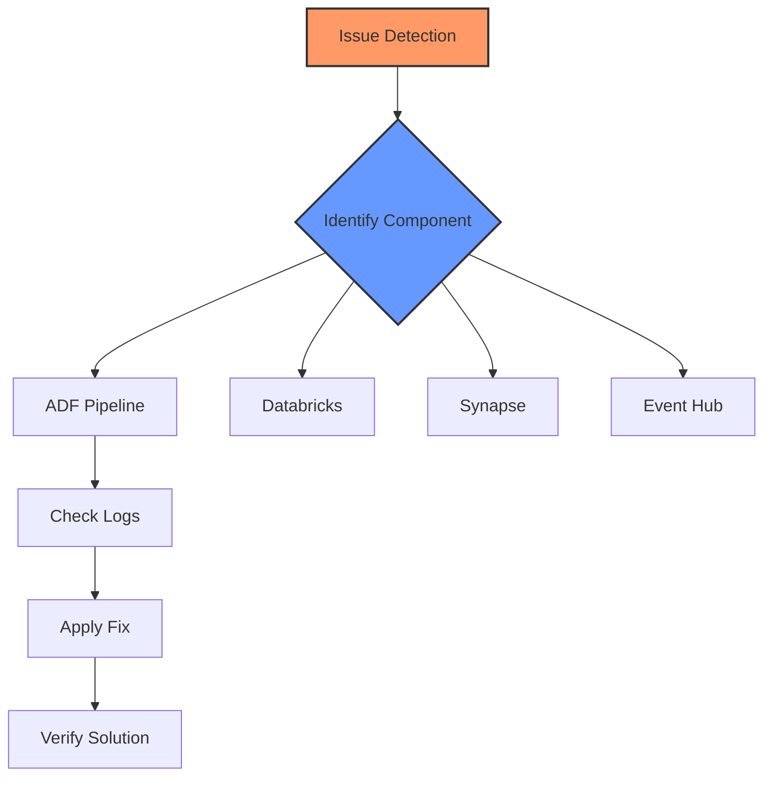
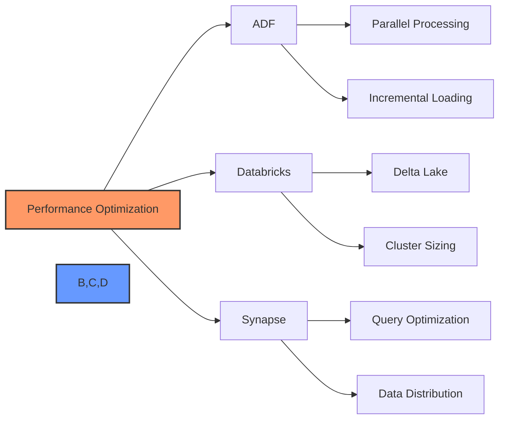
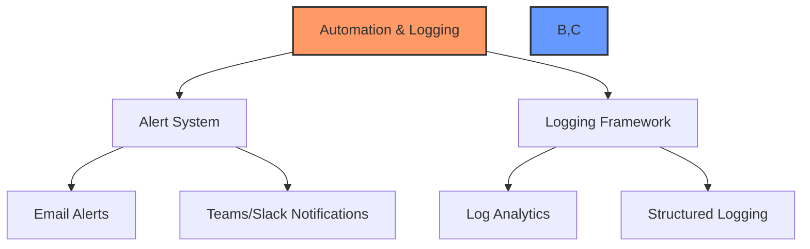

# Nikhil Project 2

## 3. Support Engineer Responsibilities

### 3.1 Monitoring & Issue Detection

Support Engineers play a crucial role in maintaining the health and performance of Azure data platform components. They are responsible for continuous monitoring of various services to ensure smooth operations and quick detection of potential issues. This involves utilizing multiple monitoring tools and implementing proactive alert mechanisms.

The monitoring process involves regular checks of:

- Pipeline health in Azure Data Factory through Azure Monitor, tracking successful vs. failed activities
- Databricks job execution metrics including runtime, resource utilization, and error patterns
- Event Hub throughput, latency, and message processing statistics
- Synapse Analytics query performance and resource utilization patterns

### 3.2 Troubleshooting & Incident Resolution

When issues are detected, Support Engineers follow a structured approach to troubleshooting and resolution. This involves systematic investigation of the problem, root cause analysis, and implementation of both immediate fixes and long-term solutions.

The incident resolution process typically involves:

- Immediate investigation using monitoring tools to identify the scope and impact of the issue
- Analysis of error logs and system metrics to determine the root cause
- Implementation of necessary fixes, whether temporary workarounds or permanent solutions
- Documentation of the incident and resolution steps for future reference

### 3.3 Enhancements & Performance Tuning

A key responsibility of Support Engineers is to continuously improve system performance through various optimization techniques and best practices implementation.

Performance optimization strategies include:

- Implementing efficient data loading patterns such as incremental loads and parallel processing
- Optimizing Databricks jobs through proper cluster configuration and code optimization
- Enhancing Synapse query performance through proper indexing and distribution strategies
- Regular monitoring and tuning of Event Hub throughput and scaling settings

### 3.4 Automation & Logging Improvements

Support Engineers implement robust automation and logging mechanisms to improve system reliability and troubleshooting capabilities.

Key automation and logging improvements include:

- Setting up automated alert systems using Azure Logic Apps and Power Automate
- Implementing comprehensive logging strategies across all platform components
- Creating automated response mechanisms for common issues
- Maintaining detailed documentation of all automated processes and logging mechanisms