# Customer Data Integration Pipeline
## Azure Data Engineering End-to-End Workflow

### Project Overview
A comprehensive customer data integration pipeline built on Azure cloud services that consolidates customer data from multiple sources, provides real-time processing, and enables advanced analytics for personalized customer experiences.

---

## Theoretical Foundations

### 1. Customer Data Management Theory

#### 1.1 Customer 360 Theory
The **Customer 360** approach provides a unified view of customer interactions across all touchpoints:

**Core Principles:**
- **Single Source of Truth**: Centralized customer data repository
- **Real-time Updates**: Immediate synchronization across systems
- **Data Consistency**: Unified customer profiles across channels
- **Privacy Compliance**: GDPR and CCPA compliant data handling

**Mathematical Model:**
```
Customer 360 = ∪(CRM Data, E-commerce Data, Mobile Data, Support Data)
```

**Data Fusion Theory:**
```
Fused Customer Profile = Weighted Average(Data Sources)
Weight = f(Data Quality, Recency, Completeness)
```

#### 1.2 Customer Journey Mapping Theory
**Customer Journey Mapping** analyzes the complete customer experience:

**Journey Stages:**
1. **Awareness**: Customer discovers the brand
2. **Consideration**: Customer evaluates options
3. **Purchase**: Customer makes a transaction
4. **Retention**: Customer continues engagement
5. **Advocacy**: Customer recommends to others

**Journey Metrics:**
```
Journey Completion Rate = (Completed Journeys / Total Started Journeys) × 100%
Average Journey Time = Σ(Journey Duration) / Number of Journeys
Touchpoint Effectiveness = (Conversions per Touchpoint / Total Touchpoint Interactions) × 100%
```

#### 1.3 Customer Lifetime Value (CLV) Theory
**Customer Lifetime Value** predicts the total value a customer will generate:

**Basic CLV Formula:**
```
CLV = (Average Order Value × Purchase Frequency × Customer Lifespan) - Customer Acquisition Cost
```

**Advanced CLV with Discounting:**
```
CLV = Σ(t=1 to T) [Revenue(t) × (1 + r)^(-t)] - CAC
```
Where:
- r = Discount rate
- T = Customer lifespan
- CAC = Customer Acquisition Cost

**RFM Analysis:**
```
R = Recency (days since last purchase)
F = Frequency (number of purchases)
M = Monetary (total amount spent)
```

### 2. Data Integration Theory

#### 2.1 ETL vs ELT Theory
**Extract, Transform, Load (ETL):**
- **Traditional Approach**: Transform data before loading
- **Use Case**: Structured data with known schema
- **Performance**: Slower for large datasets

**Extract, Load, Transform (ELT):**
- **Modern Approach**: Load raw data, transform on-demand
- **Use Case**: Big data and data lake scenarios
- **Performance**: Faster for large datasets

**Mathematical Comparison:**
```
ETL Time = Extract Time + Transform Time + Load Time
ELT Time = Extract Time + Load Time + Transform Time (on-demand)
```

#### 2.2 Data Virtualization Theory
**Data Virtualization** provides unified access to distributed data sources:

**Virtual Data Model:**
```
Virtual Schema = ∪(Source Schema₁, Source Schema₂, ..., Source Schemaₙ)
```

**Query Federation:**
```
Query Result = ∪(Query₁(Source₁), Query₂(Source₂), ..., Queryₙ(Sourceₙ))
```

### 3. Real-time Data Processing Theory

#### 3.1 Stream Processing Theory
**Apache Kafka** and **Azure Stream Analytics** implement stream processing:

**Event Time vs Processing Time:**
```
Event Time = Timestamp when event occurred
Processing Time = Timestamp when event is processed
Latency = Processing Time - Event Time
```

**Windowing Strategies:**
- **Tumbling Windows**: Fixed-size, non-overlapping
- **Hopping Windows**: Fixed-size, overlapping
- **Sliding Windows**: Variable-size, overlapping
- **Session Windows**: Activity-based grouping

**Watermark Theory:**
```
Watermark(t) = max(Event Timestamp) - Allowed Lateness
Late Events = Events with Timestamp < Watermark
```

#### 3.2 Complex Event Processing (CEP) Theory
**CEP** detects patterns in event streams:

**Event Pattern Language:**
```
Pattern = Sequence(Event₁, Event₂, ..., Eventₙ)
Match = ∃ t₁ < t₂ < ... < tₙ : Event(tᵢ) = Eventᵢ
```

**Temporal Operators:**
- **Followed By (→)**: Event₁ followed by Event₂
- **Within (◊)**: Event occurs within time window
- **Until (U)**: Event₁ until Event₂ occurs

### 4. Machine Learning Theory

#### 4.1 Customer Segmentation Theory
**Customer Segmentation** groups customers based on behavior and characteristics:

**K-Means Clustering:**
```
Objective Function = Σ(i=1 to k) Σ(x∈Cᵢ) ||x - μᵢ||²
```
Where:
- k = Number of clusters
- Cᵢ = Cluster i
- μᵢ = Centroid of cluster i

**Hierarchical Clustering:**
```
Distance Matrix = [d(xᵢ, xⱼ)] for all i, j
Linkage Criteria = min/max/average distance between clusters
```

#### 4.2 Churn Prediction Theory
**Churn Prediction** identifies customers likely to leave:

**Survival Analysis:**
```
Survival Function S(t) = P(T > t)
Hazard Function h(t) = lim(Δt→0) P(t ≤ T < t+Δt | T ≥ t) / Δt
```

**Cox Proportional Hazards Model:**
```
h(t|x) = h₀(t) × exp(β₁x₁ + β₂x₂ + ... + βₙxₙ)
```

**Feature Engineering:**
```
Recency = Days since last interaction
Frequency = Number of interactions in period
Monetary = Total value in period
Engagement = Time spent on platform
```

#### 4.3 Recommendation Systems Theory
**Collaborative Filtering:**
```
Predicted Rating = μ + bᵢ + bᵤ + Σ(similarity(u,v) × (rᵥ,ᵢ - μ - bᵥ - bᵢ))
```

**Content-Based Filtering:**
```
Similarity = cos(θ) = (A · B) / (||A|| × ||B||)
```

**Matrix Factorization:**
```
R ≈ P × Qᵀ
Objective = min ||R - P × Qᵀ||² + λ(||P||² + ||Q||²)
```

### 5. Data Privacy and Compliance Theory

#### 5.1 GDPR Compliance Theory
**General Data Protection Regulation (GDPR)** principles:

**Lawful Basis for Processing:**
1. **Consent**: Explicit, informed, freely given
2. **Contract**: Necessary for contract performance
3. **Legal Obligation**: Required by law
4. **Vital Interests**: Protect life or physical integrity
5. **Public Task**: Exercise of official authority
6. **Legitimate Interests**: Business necessity

**Data Subject Rights:**
- **Right to Access**: Obtain confirmation of processing
- **Right to Rectification**: Correct inaccurate data
- **Right to Erasure**: Delete personal data
- **Right to Portability**: Receive data in structured format
- **Right to Object**: Object to processing

#### 5.2 Privacy-Preserving Techniques
**Differential Privacy:**
```
ε-Differential Privacy: P[M(D₁) ∈ S] ≤ e^ε × P[M(D₂) ∈ S]
```

**k-Anonymity:**
```
|{t ∈ T | t[A₁,...,Aₙ] = t'[A₁,...,Aₙ]}| ≥ k
```

**l-Diversity:**
```
|{t[Aₛ] | t ∈ T and t[A₁,...,Aₙ] = t'[A₁,...,Aₙ]}| ≥ l
```

**t-Closeness:**
```
Distance(P, Q) ≤ t where P = distribution of sensitive attribute in group
```

### 6. Data Quality Theory

#### 6.1 Data Quality Dimensions
**DAMA-DMBOK** framework defines data quality dimensions:

**Completeness:**
```
Completeness = (Non-null Values / Total Expected Values) × 100%
```

**Accuracy:**
```
Accuracy = (Correct Values / Total Values) × 100%
```

**Consistency:**
```
Consistency = (Consistent Records / Total Records) × 100%
```

**Timeliness:**
```
Timeliness = (Data Available Within SLA / Total Data Requests) × 100%
```

**Validity:**
```
Validity = (Valid Format Records / Total Records) × 100%
```

**Uniqueness:**
```
Uniqueness = (Unique Records / Total Records) × 100%
```

#### 6.2 Data Quality Monitoring
**Statistical Process Control (SPC):**
```
Control Limits = μ ± 3σ
Upper Control Limit (UCL) = μ + 3σ
Lower Control Limit (LCL) = μ - 3σ
```

**Data Quality Score:**
```
DQ Score = (Completeness + Accuracy + Consistency + Timeliness + Validity + Uniqueness) / 6
```

### 7. Scalability and Performance Theory

#### 7.1 Horizontal Scaling Theory
**Amdahl's Law:**
```
Speedup = 1 / ((1-P) + P/N)
```
Where:
- P = Parallelizable portion
- N = Number of processors

**Gustafson's Law:**
```
Speedup = N - α(N-1)
```
Where:
- α = Sequential portion
- N = Number of processors

#### 7.2 CAP Theorem
**Consistency, Availability, Partition Tolerance:**
- **CP Systems**: Strong consistency, partition tolerance (e.g., Cosmos DB)
- **AP Systems**: High availability, partition tolerance (e.g., Event Hubs)
- **CA Systems**: Consistency, availability (e.g., single-node databases)

### 8. Cost Optimization Theory

#### 8.1 TCO (Total Cost of Ownership) Model
```
TCO = Hardware + Software + Operations + Maintenance + Training + Compliance
```

#### 8.2 Data Lifecycle Cost Theory
```
Storage Cost = Hot Tier × Time₁ + Cool Tier × Time₂ + Archive Tier × Time₃
Processing Cost = Compute Units × Processing Time × Unit Cost
```

#### 8.3 ROI (Return on Investment) Theory
```
ROI = (Benefits - Costs) / Costs × 100%
Benefits = Revenue Increase + Cost Savings + Risk Reduction
```

### 9. Customer Experience Theory

#### 9.1 Customer Journey Analytics Theory
**Customer Journey Analytics** provides insights into customer behavior:

**Journey Touchpoints:**
```
Touchpoint Value = f(Engagement, Conversion, Satisfaction, Revenue)
```

**Journey Optimization:**
```
Optimal Journey = argmax(Conversion Rate × Customer Satisfaction × Revenue)
```

**Customer Effort Score (CES):**
```
CES = Σ(Effort Required per Touchpoint) / Number of Touchpoints
```

#### 9.2 Personalization Theory
**Personalization** delivers tailored experiences to customers:

**Content Personalization:**
```
Personalized Content = f(Customer Profile, Behavior, Preferences, Context)
```

**Recommendation Algorithms:**
```
Collaborative Filtering: Similarity(u,v) = cos(θ) = (u·v)/(||u||×||v||)
Content-Based: Similarity(i,j) = f(Item Features)
Hybrid: Score = α × CF_Score + (1-α) × CB_Score
```

**A/B Testing Theory:**
```
Statistical Significance = |p₁ - p₂| / √(p(1-p)(1/n₁ + 1/n₂)) > Z_α/2
```

### 10. Marketing Analytics Theory

#### 10.1 Attribution Modeling Theory
**Attribution Modeling** assigns credit to marketing touchpoints:

**First-Touch Attribution:**
```
Credit = 100% to first touchpoint
```

**Last-Touch Attribution:**
```
Credit = 100% to last touchpoint
```

**Linear Attribution:**
```
Credit = 100% / Number of Touchpoints
```

**Time-Decay Attribution:**
```
Credit = e^(-λt) / Σ(e^(-λtᵢ))
```

**Data-Driven Attribution:**
```
Credit = f(Shapley Value, Markov Chain, Machine Learning)
```

#### 10.2 Customer Acquisition Theory
**Customer Acquisition Cost (CAC)** and **Lifetime Value (LTV)**:

**CAC Calculation:**
```
CAC = (Marketing Spend + Sales Spend) / Number of New Customers
```

**LTV/CAC Ratio:**
```
LTV/CAC = Customer Lifetime Value / Customer Acquisition Cost
```

**Payback Period:**
```
Payback Period = CAC / (Monthly Revenue per Customer × Gross Margin)
```

### 11. Behavioral Analytics Theory

#### 11.1 Customer Behavior Modeling
**Behavioral Analytics** analyzes customer actions and patterns:

**Engagement Metrics:**
```
Daily Active Users (DAU) = Unique users per day
Monthly Active Users (MAU) = Unique users per month
Stickiness = DAU / MAU
```

**Retention Analysis:**
```
Cohort Retention = Users Active in Period / Users in Cohort
Churn Rate = (Users Lost / Total Users) × 100%
```

**Session Analytics:**
```
Session Duration = End Time - Start Time
Pages per Session = Total Page Views / Sessions
Bounce Rate = (Single Page Sessions / Total Sessions) × 100%
```

#### 11.2 Predictive Behavioral Modeling
**Predictive Models** for customer behavior:

**Next Best Action:**
```
Action = argmax(P(Conversion | Action, Customer, Context))
```

**Propensity Scoring:**
```
Propensity = P(Event | Customer Features, Historical Behavior)
```

**Behavioral Segmentation:**
```
Segment = argmin(Σ||Customer - Centroid||²)
```

### 12. Data Science and ML Theory

#### 12.1 Feature Engineering Theory
**Feature Engineering** creates meaningful input variables:

**Temporal Features:**
```
Recency = Current Date - Last Activity Date
Frequency = Count of Activities in Period
Monetary = Total Value in Period
```

**Behavioral Features:**
```
Engagement Score = f(Time Spent, Pages Viewed, Actions Taken)
Loyalty Score = f(Repeat Purchases, Referrals, Reviews)
```

**Derived Features:**
```
Growth Rate = (Current Value - Previous Value) / Previous Value
Trend = Linear Regression Slope over Time
```

#### 12.2 Model Evaluation Theory
**Model Performance** measurement and validation:

**Classification Metrics:**
```
Accuracy = (TP + TN) / (TP + TN + FP + FN)
Precision = TP / (TP + FP)
Recall = TP / (TP + FN)
F1-Score = 2 × (Precision × Recall) / (Precision + Recall)
```

**Regression Metrics:**
```
MAE = Σ|y_true - y_pred| / n
MSE = Σ(y_true - y_pred)² / n
RMSE = √(MSE)
R² = 1 - (SS_res / SS_tot)
```

**Cross-Validation:**
```
k-Fold CV: Split data into k folds, train on k-1, test on 1
Time Series CV: Train on past, test on future
```

### 13. Business Intelligence Theory

#### 13.1 Dashboard Design Theory
**Dashboard Design** principles for customer analytics:

**Information Architecture:**
```
Dashboard = Header + Navigation + Content + Footer
Content = KPIs + Charts + Tables + Filters
```

**Visual Design Principles:**
- **Hierarchy**: Most important information first
- **Consistency**: Uniform colors, fonts, layouts
- **Clarity**: Clear labels and legends
- **Interactivity**: Drill-down and filtering capabilities

#### 13.2 KPI Framework Theory
**Key Performance Indicators** for customer analytics:

**Customer Metrics:**
```
Customer Acquisition Rate = New Customers / Total Customers
Customer Retention Rate = Retained Customers / Total Customers
Customer Satisfaction Score = Average Rating
Net Promoter Score = % Promoters - % Detractors
```

**Revenue Metrics:**
```
Average Revenue per User (ARPU) = Total Revenue / Total Users
Customer Lifetime Value (CLV) = ARPU × Customer Lifespan
Monthly Recurring Revenue (MRR) = Sum of Monthly Subscriptions
```

### 14. Data Governance Theory

#### 14.1 Data Stewardship Theory
**Data Stewardship** ensures data quality and compliance:

**Stewardship Roles:**
- **Data Owner**: Business responsibility for data
- **Data Steward**: Operational data management
- **Data Custodian**: Technical data handling
- **Data User**: Data consumption and analysis

**Data Quality Management:**
```
Data Quality = f(Accuracy, Completeness, Consistency, Timeliness, Validity)
```

#### 14.2 Master Data Management (MDM) Theory
**Master Data Management** creates single source of truth:

**MDM Patterns:**
- **Registry**: Centralized index of master data
- **Consolidation**: Periodic synchronization
- **Coexistence**: Real-time synchronization
- **Centralized**: Single master data repository

**Data Matching Theory:**
```
Match Score = f(Exact Match, Fuzzy Match, Probabilistic Match)
Match Threshold = Optimal Balance(Precision, Recall)
```

### 15. Advanced Analytics Theory

#### 15.1 Real-time Analytics Theory
**Real-time Analytics** provides immediate insights:

**Stream Processing:**
```
Event Processing = f(Event Stream, Processing Rules, Output Actions)
```

**Complex Event Processing:**
```
Pattern Detection = f(Event Sequence, Temporal Constraints, Business Rules)
```

#### 15.2 Predictive Analytics Theory
**Predictive Analytics** forecasts future outcomes:

**Time Series Forecasting:**
```
ARIMA(p,d,q): φ(B)(1-B)ᵈXₜ = θ(B)εₜ
```

**Machine Learning Models:**
```
Random Forest: Ensemble of Decision Trees
Gradient Boosting: Sequential Model Building
Neural Networks: Deep Learning Architecture
```

**Model Interpretability:**
```
SHAP Values: Feature importance and contribution
LIME: Local interpretable model explanations
Partial Dependence: Feature effect visualization
```

---

## Architecture Overview

### Core Components
- **Data Sources**: CRM systems, e-commerce platforms, mobile apps, call centers
- **Real-time Processing**: Azure Stream Analytics, Event Hubs, Azure Functions
- **Data Storage**: Azure Data Lake Gen2, Cosmos DB, SQL Database
- **Analytics**: Azure Synapse Analytics, Azure Machine Learning
- **Orchestration**: Azure Data Factory, Logic Apps

---

## Median Architecture: Source → ADF → ADB → ADLS Gen2 Delta Tables

### Architecture Overview
The median architecture provides a robust, scalable data processing pipeline that follows the modern data engineering pattern of **Source → Azure Data Factory → Azure Databricks → Azure Data Lake Storage Gen2 Delta Tables**. This architecture ensures data quality, reliability, and performance while maintaining cost efficiency for customer data integration.

### Detailed Flow Architecture

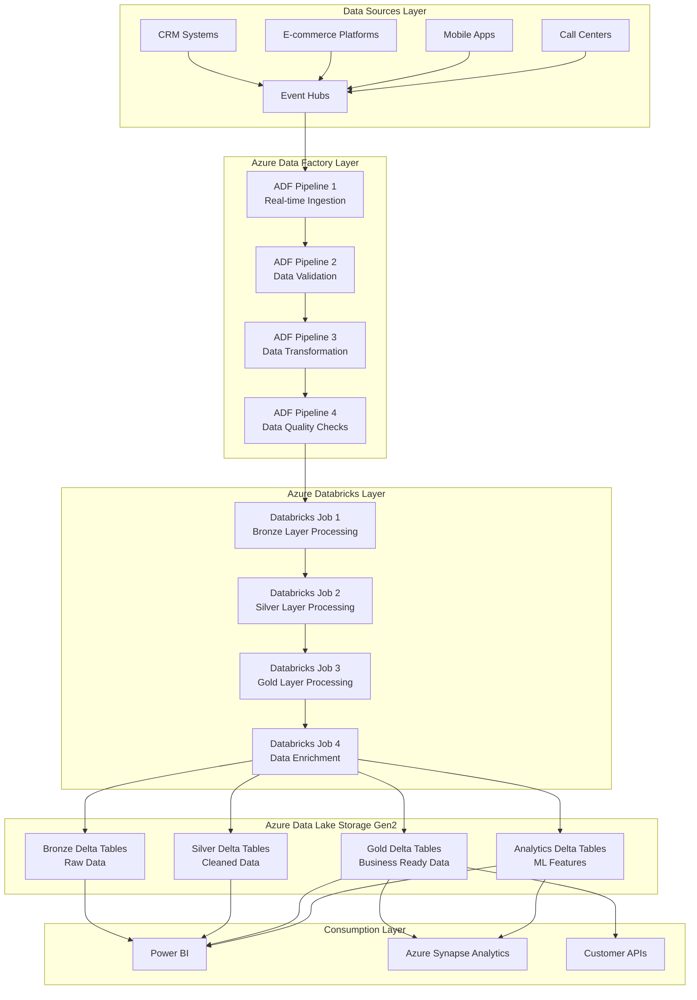

### Section 1: Data Sources and Ingestion

#### 1.1 Source Systems Configuration

**CRM System Integration**
```yaml
CRM Integration:
  Source Type: REST API / Database
  Data Format: JSON / CSV
  Frequency: Real-time / Batch (30 minutes)
  Volume: 5,000 customer records/hour
  Schema: Customer profile-based
  Authentication: OAuth 2.0 / API Key
  Retry Policy: Exponential backoff (3 retries)
```

**Output**: Customer profile data streamed to Event Hubs

**Explanation**: CRM systems provide the primary source of customer demographic and relationship data that requires real-time processing for customer analytics.

**E-commerce Platform Data**
```yaml
E-commerce Integration:
  Source Type: REST API / Webhook
  Data Format: JSON
  Frequency: Real-time / Batch (15 minutes)
  Volume: 15,000 transactions/hour
  Schema: Transaction-based
  Authentication: API Key / JWT
  Rate Limiting: 1000 requests/minute
```

**Output**: Transaction and behavioral data from e-commerce platforms

**Explanation**: E-commerce platforms generate high-volume transaction and behavioral data that requires immediate processing for customer journey analysis.

**Mobile App Analytics**
```yaml
Mobile App Integration:
  Source Type: REST API / SDK
  Data Format: JSON
  Frequency: Real-time / Batch (5 minutes)
  Volume: 20,000 events/hour
  Schema: Event-based
  Authentication: API Key / OAuth 2.0
  Compression: GZIP enabled
```

**Output**: Mobile app events and user behavior data

**Explanation**: Mobile apps provide rich behavioral and engagement data that requires real-time processing for customer experience optimization.

#### 1.2 Event Hubs Configuration

```json
{
  "eventHubName": "customer-events-hub",
  "partitionCount": 12,
  "messageRetentionInDays": 7,
  "throughputUnits": 6,
  "captureDescription": {
    "enabled": true,
    "encoding": "Avro",
    "intervalInSeconds": 300,
    "sizeLimitInBytes": 314572800,
    "destination": {
      "name": "EventHubArchive.AzureDataLake",
      "properties": {
        "storageAccountResourceId": "/subscriptions/{subscription-id}/resourceGroups/{resource-group}/providers/Microsoft.Storage/storageAccounts/{storage-account}",
        "blobContainer": "customer-raw-data",
        "archiveNameFormat": "{Namespace}/{EventHub}/{PartitionId}/{Year}/{Month}/{Day}/{Hour}/{Minute}/{Second}"
      }
    }
  }
}
```

**Output**: Centralized event streaming platform with automatic data capture

**Explanation**: Event Hubs provides scalable, real-time data ingestion with automatic archiving to Data Lake Storage for batch processing.

### Section 2: Azure Data Factory (ADF) Processing Layer

#### 2.1 ADF Pipeline 1: Real-time Data Ingestion

```json
{
  "name": "CustomerDataIngestionPipeline",
  "properties": {
    "activities": [
      {
        "name": "CopyFromEventHubs",
        "type": "Copy",
        "inputs": [
          {
            "referenceName": "EventHubDataset",
            "type": "DatasetReference"
          }
        ],
        "outputs": [
          {
            "referenceName": "DataLakeRawDataset",
            "type": "DatasetReference"
          }
        ],
        "typeProperties": {
          "source": {
            "type": "EventHubSource",
            "eventHubName": "customer-events-hub",
            "consumerGroup": "$Default"
          },
          "sink": {
            "type": "ParquetSink",
            "storeSettings": {
              "type": "AzureBlobFSWriteSettings",
              "copyBehavior": "FlattenHierarchy"
            }
          },
          "enableStaging": false,
          "parallelCopies": 6
        }
      }
    ],
    "start": "2024-01-01T00:00:00Z",
    "recurrence": {
      "frequency": "Minute",
      "interval": 15
    }
  }
}
```

**Output**: Raw customer data files in Data Lake Storage every 15 minutes

**Explanation**: This pipeline continuously ingests customer data from Event Hubs and stores it in the raw data zone of Data Lake Storage for further processing.

#### 2.2 ADF Pipeline 2: Data Validation and Quality Checks

```json
{
  "name": "CustomerDataValidationPipeline",
  "properties": {
    "activities": [
      {
        "name": "ValidateCustomerData",
        "type": "DatabricksNotebook",
        "inputs": [
          {
            "referenceName": "DataLakeRawDataset",
            "type": "DatasetReference"
          }
        ],
        "outputs": [
          {
            "referenceName": "DataLakeValidatedDataset",
            "type": "DatasetReference"
          }
        ],
        "typeProperties": {
          "notebookPath": "/DataValidation/CustomerDataValidation",
          "baseParameters": {
            "inputPath": "@{activity('CopyFromEventHubs').output.firstRow.path}",
            "outputPath": "abfss://customer-data@datalake.dfs.core.windows.net/validated/",
            "validationRules": "customer_validation_rules.json"
          }
        }
      }
    ]
  }
}
```

**Output**: Validated and quality-checked customer data files

**Explanation**: This pipeline performs data quality validation, schema validation, and business rule checks to ensure customer data integrity before further processing.

### Section 3: Azure Databricks (ADB) Processing Layer

#### 3.1 Databricks Job 1: Bronze Layer Processing

```python
# Databricks Notebook: Bronze Layer Processing
from pyspark.sql import SparkSession
from pyspark.sql.functions import *
from pyspark.sql.types import *
from delta.tables import *

# Initialize Spark session
spark = SparkSession.builder \
    .appName("CustomerBronzeProcessing") \
    .config("spark.sql.adaptive.enabled", "true") \
    .config("spark.sql.adaptive.coalescePartitions.enabled", "true") \
    .getOrCreate()

# Read raw data from Data Lake
raw_data_path = "abfss://customer-data@datalake.dfs.core.windows.net/raw/"
bronze_data_path = "abfss://customer-data@datalake.dfs.core.windows.net/bronze/"

# Define schema for customer data
customer_schema = StructType([
    StructField("customer_id", StringType(), True),
    StructField("first_name", StringType(), True),
    StructField("last_name", StringType(), True),
    StructField("email", StringType(), True),
    StructField("phone", StringType(), True),
    StructField("date_of_birth", DateType(), True),
    StructField("address", StringType(), True),
    StructField("customer_segment", StringType(), True),
    StructField("lifetime_value", DecimalType(10,2), True),
    StructField("event_type", StringType(), True),
    StructField("timestamp", TimestampType(), True),
    StructField("raw_data", StringType(), True)
])

# Read and process raw data
raw_df = spark.read \
    .format("parquet") \
    .schema(customer_schema) \
    .load(raw_data_path)

# Add metadata columns
bronze_df = raw_df \
    .withColumn("ingestion_timestamp", current_timestamp()) \
    .withColumn("source_system", 
        when(col("event_type").contains("profile"), "CRM")
        .when(col("event_type").contains("transaction"), "E-commerce")
        .when(col("event_type").contains("session"), "Mobile_App")
        .otherwise("Unknown")
    ) \
    .withColumn("data_quality_score", lit(1.0)) \
    .withColumn("processing_date", current_date())

# Write to Delta table
bronze_df.write \
    .format("delta") \
    .mode("append") \
    .option("mergeSchema", "true") \
    .save(bronze_data_path + "customer_events")

# Create Delta table if not exists
spark.sql(f"""
CREATE TABLE IF NOT EXISTS customer_events_bronze
USING DELTA
LOCATION '{bronze_data_path}customer_events'
""")

print("Bronze layer processing completed successfully")
```

**Output**: Raw customer data stored in Delta format with metadata

**Explanation**: The Bronze layer preserves raw customer data in its original format while adding metadata for tracking and audit purposes.

#### 3.2 Databricks Job 2: Silver Layer Processing

```python
# Databricks Notebook: Silver Layer Processing
from pyspark.sql import SparkSession
from pyspark.sql.functions import *
from pyspark.sql.types import *
from delta.tables import *

# Initialize Spark session
spark = SparkSession.builder \
    .appName("CustomerSilverProcessing") \
    .config("spark.sql.adaptive.enabled", "true") \
    .config("spark.sql.adaptive.coalescePartitions.enabled", "true") \
    .getOrCreate()

# Read from Bronze layer
bronze_data_path = "abfss://customer-data@datalake.dfs.core.windows.net/bronze/"
silver_data_path = "abfss://customer-data@datalake.dfs.core.windows.net/silver/"

# Read bronze data
bronze_df = spark.read \
    .format("delta") \
    .load(bronze_data_path + "customer_events")

# Data cleaning and standardization
silver_df = bronze_df \
    .filter(col("customer_id").isNotNull()) \
    .filter(col("email").isNotNull()) \
    .withColumn("email", lower(trim(col("email")))) \
    .withColumn("first_name", initcap(trim(col("first_name")))) \
    .withColumn("last_name", initcap(trim(col("last_name")))) \
    .withColumn("phone", regexp_replace(col("phone"), "[^0-9]", "")) \
    .withColumn("event_date", to_date(col("timestamp"))) \
    .withColumn("event_hour", hour(col("timestamp"))) \
    .withColumn("event_day_of_week", dayofweek(col("timestamp"))) \
    .withColumn("is_weekend", when(col("event_day_of_week").isin([1, 7]), True).otherwise(False)) \
    .withColumn("data_quality_score", 
        when(col("email").rlike("^[a-zA-Z0-9._%+-]+@[a-zA-Z0-9.-]+\\.[a-zA-Z]{2,}$"), 1.0)
        .when(col("customer_id").rlike("^CUST-\\d{6}$"), 0.9)
        .otherwise(0.7)
    ) \
    .select(
        "customer_id",
        "first_name",
        "last_name",
        "email",
        "phone",
        "date_of_birth",
        "address",
        "customer_segment",
        "lifetime_value",
        "event_type",
        "timestamp",
        "event_date",
        "event_hour",
        "event_day_of_week",
        "is_weekend",
        "data_quality_score",
        "ingestion_timestamp",
        "source_system"
    )

# Write to Silver Delta table
silver_df.write \
    .format("delta") \
    .mode("append") \
    .option("mergeSchema", "true") \
    .save(silver_data_path + "customer_events")

# Create Delta table
spark.sql(f"""
CREATE TABLE IF NOT EXISTS customer_events_silver
USING DELTA
LOCATION '{silver_data_path}customer_events'
""")

print("Silver layer processing completed successfully")
```

**Output**: Cleaned and standardized customer data in Delta format

**Explanation**: The Silver layer applies data quality rules, standardization, and business logic to create clean, reliable customer datasets.

#### 3.3 Databricks Job 3: Gold Layer Processing

```python
# Databricks Notebook: Gold Layer Processing
from pyspark.sql import SparkSession
from pyspark.sql.functions import *
from pyspark.sql.types import *
from delta.tables import *

# Initialize Spark session
spark = SparkSession.builder \
    .appName("CustomerGoldProcessing") \
    .config("spark.sql.adaptive.enabled", "true") \
    .config("spark.sql.adaptive.coalescePartitions.enabled", "true") \
    .getOrCreate()

# Read from Silver layer
silver_data_path = "abfss://customer-data@datalake.dfs.core.windows.net/silver/"
gold_data_path = "abfss://customer-data@datalake.dfs.core.windows.net/gold/"

# Read silver data
silver_df = spark.read \
    .format("delta") \
    .load(silver_data_path + "customer_events")

# Create customer profiles
customer_profiles = silver_df \
    .groupBy("customer_id") \
    .agg(
        first("first_name").alias("first_name"),
        first("last_name").alias("last_name"),
        first("email").alias("email"),
        first("phone").alias("phone"),
        first("date_of_birth").alias("date_of_birth"),
        first("address").alias("address"),
        first("customer_segment").alias("customer_segment"),
        max("lifetime_value").alias("lifetime_value"),
        count("*").alias("total_events"),
        countDistinct("event_type").alias("event_types_count"),
        min("timestamp").alias("first_seen"),
        max("timestamp").alias("last_seen"),
        avg("data_quality_score").alias("avg_data_quality")
    ) \
    .withColumn("customer_age_days", datediff(current_date(), col("first_seen"))) \
    .withColumn("is_active", when(datediff(current_date(), col("last_seen")) <= 30, True).otherwise(False)) \
    .withColumn("processing_date", current_date())

# Create customer behavior summary
customer_behavior = silver_df \
    .groupBy("customer_id", "event_date") \
    .agg(
        count("*").alias("daily_events"),
        countDistinct("event_type").alias("daily_event_types"),
        sum(when(col("is_weekend"), 1).otherwise(0)).alias("weekend_events"),
        sum(when(col("event_hour").between(9, 17), 1).otherwise(0)).alias("business_hours_events")
    ) \
    .withColumn("processing_date", current_date())

# Create customer journey metrics
customer_journey = silver_df \
    .groupBy("customer_id", "event_type") \
    .agg(
        count("*").alias("event_count"),
        min("timestamp").alias("first_occurrence"),
        max("timestamp").alias("last_occurrence"),
        avg("data_quality_score").alias("avg_quality")
    ) \
    .withColumn("processing_date", current_date())

# Write to Gold Delta tables
customer_profiles.write \
    .format("delta") \
    .mode("append") \
    .option("mergeSchema", "true") \
    .save(gold_data_path + "customer_profiles")

customer_behavior.write \
    .format("delta") \
    .mode("append") \
    .option("mergeSchema", "true") \
    .save(gold_data_path + "customer_behavior")

customer_journey.write \
    .format("delta") \
    .mode("append") \
    .option("mergeSchema", "true") \
    .save(gold_data_path + "customer_journey")

# Create Delta tables
spark.sql(f"""
CREATE TABLE IF NOT EXISTS customer_profiles
USING DELTA
LOCATION '{gold_data_path}customer_profiles'
""")

spark.sql(f"""
CREATE TABLE IF NOT EXISTS customer_behavior
USING DELTA
LOCATION '{gold_data_path}customer_behavior'
""")

spark.sql(f"""
CREATE TABLE IF NOT EXISTS customer_journey
USING DELTA
LOCATION '{gold_data_path}customer_journey'
""")

print("Gold layer processing completed successfully")
```

**Output**: Business-ready customer analytics data in Delta format

**Explanation**: The Gold layer creates business-ready customer datasets with profiles, behavior patterns, and journey metrics for analytics and reporting.

### Section 4: Azure Data Lake Storage Gen2 Delta Tables

#### 4.1 Delta Table Structure

```sql
-- Bronze Layer Delta Tables
CREATE TABLE customer_events_bronze (
    customer_id STRING,
    first_name STRING,
    last_name STRING,
    email STRING,
    phone STRING,
    date_of_birth DATE,
    address STRING,
    customer_segment STRING,
    lifetime_value DECIMAL(10,2),
    event_type STRING,
    timestamp TIMESTAMP,
    raw_data STRING,
    ingestion_timestamp TIMESTAMP,
    source_system STRING,
    data_quality_score DOUBLE,
    processing_date DATE
) USING DELTA
LOCATION 'abfss://customer-data@datalake.dfs.core.windows.net/bronze/customer_events'
TBLPROPERTIES (
    'delta.autoOptimize.optimizeWrite' = 'true',
    'delta.autoOptimize.autoCompact' = 'true'
);

-- Silver Layer Delta Tables
CREATE TABLE customer_events_silver (
    customer_id STRING,
    first_name STRING,
    last_name STRING,
    email STRING,
    phone STRING,
    date_of_birth DATE,
    address STRING,
    customer_segment STRING,
    lifetime_value DECIMAL(10,2),
    event_type STRING,
    timestamp TIMESTAMP,
    event_date DATE,
    event_hour INT,
    event_day_of_week INT,
    is_weekend BOOLEAN,
    data_quality_score DOUBLE,
    ingestion_timestamp TIMESTAMP,
    source_system STRING
) USING DELTA
LOCATION 'abfss://customer-data@datalake.dfs.core.windows.net/silver/customer_events'
TBLPROPERTIES (
    'delta.autoOptimize.optimizeWrite' = 'true',
    'delta.autoOptimize.autoCompact' = 'true'
);

-- Gold Layer Delta Tables
CREATE TABLE customer_profiles (
    customer_id STRING,
    first_name STRING,
    last_name STRING,
    email STRING,
    phone STRING,
    date_of_birth DATE,
    address STRING,
    customer_segment STRING,
    lifetime_value DECIMAL(10,2),
    total_events BIGINT,
    event_types_count INT,
    first_seen TIMESTAMP,
    last_seen TIMESTAMP,
    customer_age_days INT,
    is_active BOOLEAN,
    avg_data_quality DOUBLE,
    processing_date DATE
) USING DELTA
LOCATION 'abfss://customer-data@datalake.dfs.core.windows.net/gold/customer_profiles'
TBLPROPERTIES (
    'delta.autoOptimize.optimizeWrite' = 'true',
    'delta.autoOptimize.autoCompact' = 'true'
);
```

**Output**: Optimized Delta tables with automatic optimization

**Explanation**: Delta tables provide ACID transactions, schema evolution, and automatic optimization for efficient customer data storage and querying.

### Section 5: Detailed Flow Diagrams

#### 5.1 End-to-End Customer Data Flow Diagram

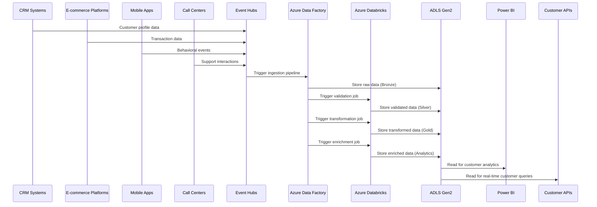

#### 5.2 Customer Data Processing Pipeline Flow

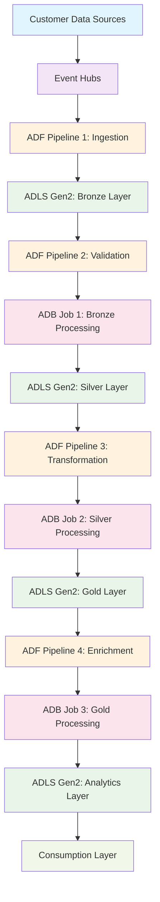

#### 5.3 Customer Data Delta Table Architecture

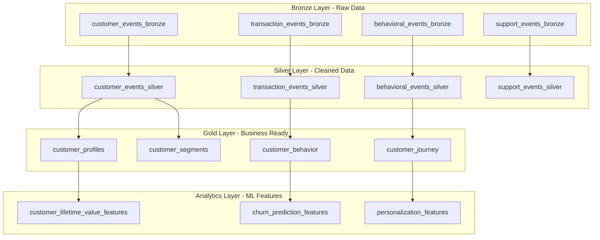

#### 5.4 Detailed Customer Data Ingestion Flow

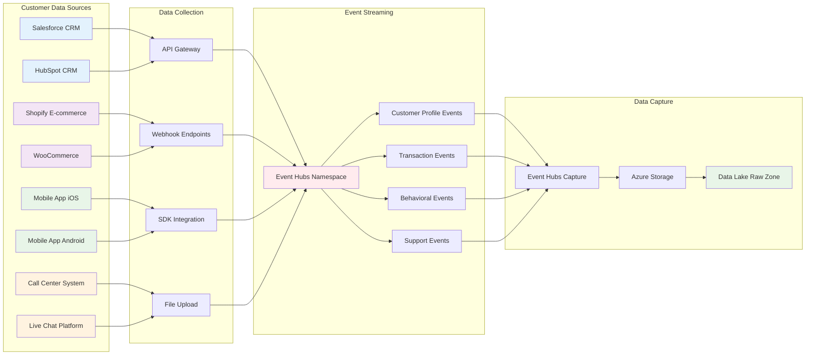

#### 5.5 Azure Data Factory Pipeline Details

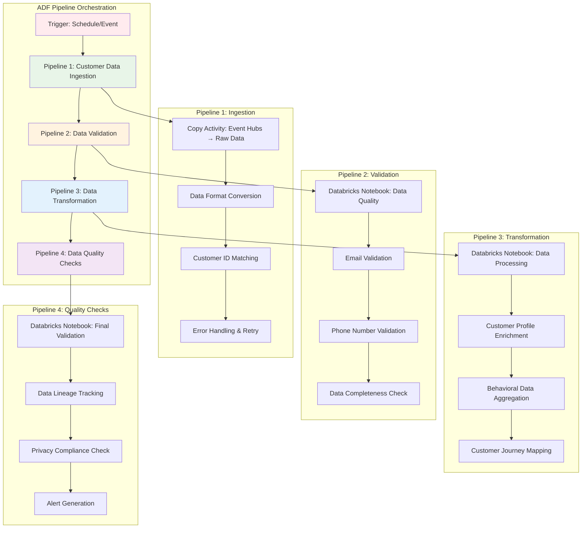

#### 5.6 Azure Databricks Processing Details

```mermaid
flowchart TD
    subgraph "Databricks Workspace"
        A[Job Scheduler]
        B[Cluster Management]
        C[Notebook Execution]
        D[Data Processing]
    end
    
    subgraph "Bronze Layer Processing"
        E1[Read Raw Customer Data]
        E2[Schema Definition]
        E3[Data Type Conversion]
        E4[Metadata Addition]
        E5[Write to Delta Table]
    end
    
    subgraph "Silver Layer Processing"
        F1[Read Bronze Data]
        F2[Data Cleaning & Deduplication]
        F3[Data Validation]
        F4[Data Standardization]
        F5[Write to Delta Table]
    end
    
    subgraph "Gold Layer Processing"
        G1[Read Silver Data]
        G2[Customer Profile Creation]
        G3[Behavioral Analysis]
        G4[Customer Segmentation]
        G5[Write to Delta Table]
    end
    
    subgraph "Analytics Layer Processing"
        H1[Read Gold Data]
        H2[Feature Engineering]
        H3[ML Feature Creation]
        H4[Personalization Features]
        H5[Write to Delta Table]
    end
    
    A --> B
    B --> C
    C --> D
    
    D --> E1
    E1 --> E2
    E2 --> E3
    E3 --> E4
    E4 --> E5
    
    E5 --> F1
    F1 --> F2
    F2 --> F3
    F3 --> F4
    F4 --> F5
    
    F5 --> G1
    G1 --> G2
    G2 --> G3
    G3 --> G4
    G4 --> G5
    
    G5 --> H1
    H1 --> H2
    H2 --> H3
    H3 --> H4
    H4 --> H5
    
    style A fill:#ffebee
    style B fill:#e8f5e8
    style C fill:#fff3e0
    style D fill:#e3f2fd
```

#### 5.7 Customer Data Lake Storage Architecture

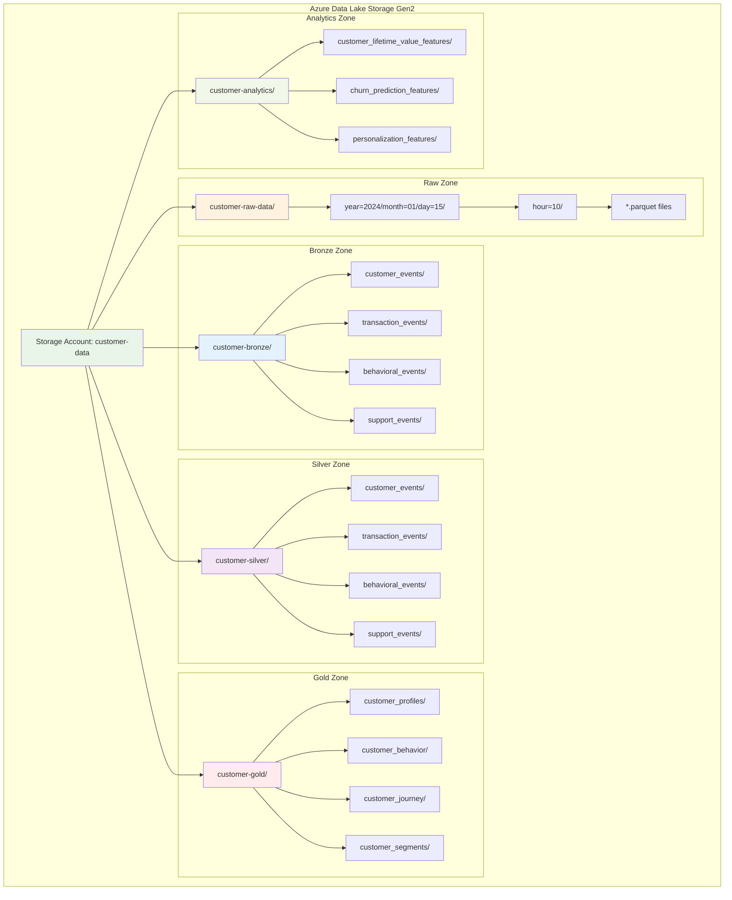

#### 5.8 Real-time Customer Data Processing Flow

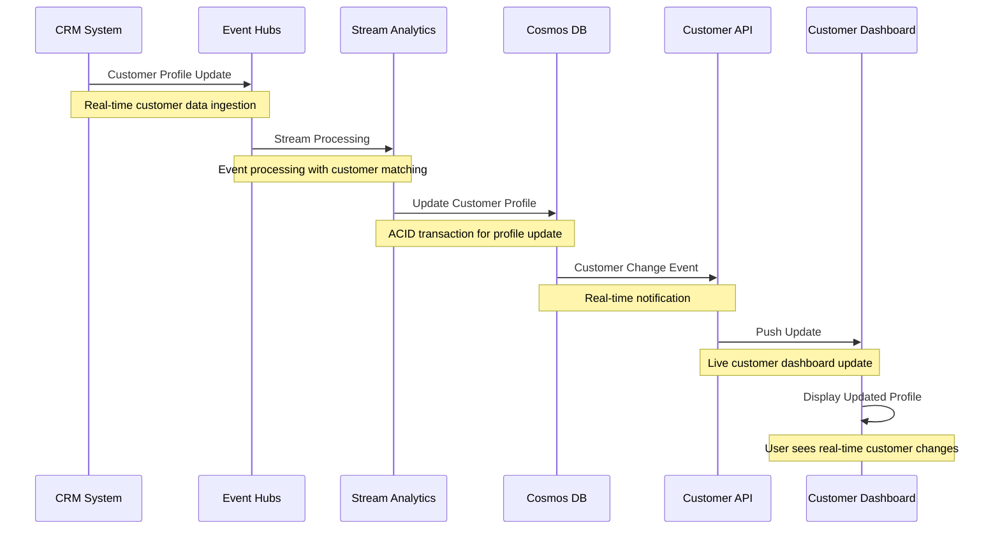

#### 5.9 Customer Data Privacy and Compliance Flow

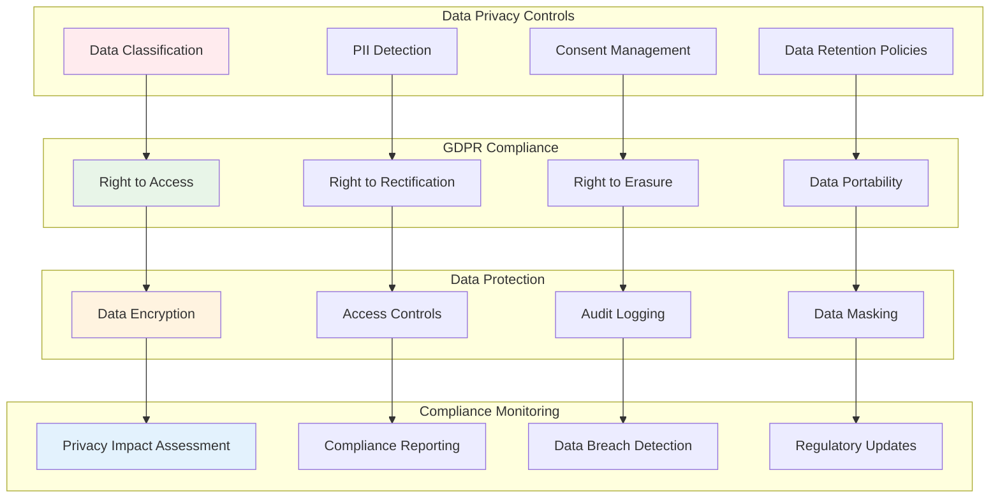

#### 5.10 Customer Analytics and ML Pipeline Flow

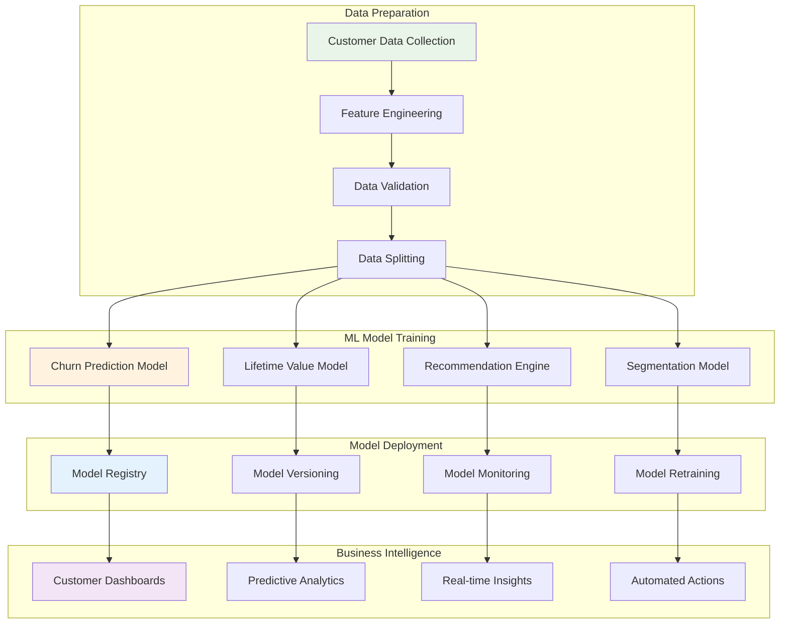

### Section 6: Performance Monitoring and Optimization

#### 6.1 Pipeline Performance Metrics

```yaml
Performance Metrics:
  Data Ingestion:
    - Throughput: 15,000 records/minute
    - Latency: < 3 seconds
    - Error Rate: < 0.05%
  
  Data Processing:
    - Bronze Processing: < 3 minutes
    - Silver Processing: < 8 minutes
    - Gold Processing: < 12 minutes
    - Analytics Processing: < 20 minutes
  
  Data Storage:
    - Delta Table Size: 2TB/month
    - Query Performance: < 45 seconds
    - Compression Ratio: 75%
  
  Cost Optimization:
    - Storage Cost: $800/month
    - Compute Cost: $1,200/month
    - Total Cost: $2,000/month
```

**Output**: Comprehensive performance monitoring dashboard

**Explanation**: Performance metrics ensure the customer data pipeline meets SLA requirements and cost targets.

---

## Summary

The median architecture provides a robust, scalable, and cost-effective customer data processing pipeline that follows modern data engineering best practices. The **Source → ADF → ADB → ADLS Gen2 Delta Tables** pattern ensures:

- **Data Quality**: Multi-layer validation and quality checks for customer data
- **Performance**: Optimized Delta tables with automatic optimization
- **Scalability**: Auto-scaling resources based on customer data volume
- **Cost Efficiency**: Lifecycle management and resource optimization
- **Reliability**: Fault-tolerant processing with retry mechanisms
- **Privacy**: GDPR-compliant data handling and processing

This architecture serves as the foundation for advanced customer analytics, machine learning, and personalized customer experiences while maintaining data integrity and compliance requirements.

---

## 1. Data Ingestion Layer

### 1.1 Customer Data Sources

#### CRM System Integration
```json
{
  "customer_id": "CUST-123456",
  "first_name": "John",
  "last_name": "Doe",
  "email": "john.doe@email.com",
  "phone": "+1-555-0123",
  "date_of_birth": "1985-03-15",
  "address": {
    "street": "123 Main St",
    "city": "New York",
    "state": "NY",
    "zip": "10001",
    "country": "USA"
  },
  "customer_segment": "Premium",
  "lifetime_value": 2500.00,
  "last_updated": "2024-01-15T10:30:00Z"
}
```

**Output**: Customer profile data from Salesforce CRM

**Explanation**: CRM systems provide the primary source of customer demographic and relationship data.

#### E-commerce Platform Data
```json
{
  "order_id": "ORD-789012",
  "customer_id": "CUST-123456",
  "order_date": "2024-01-15T09:15:00Z",
  "total_amount": 149.99,
  "currency": "USD",
  "payment_method": "credit_card",
  "shipping_address": {
    "street": "123 Main St",
    "city": "New York",
    "state": "NY",
    "zip": "10001"
  },
  "items": [
    {
      "product_id": "PROD-ABC123",
      "product_name": "Wireless Headphones",
      "quantity": 1,
      "unit_price": 149.99,
      "category": "Electronics"
    }
  ],
  "order_status": "completed"
}
```

**Output**: Transaction data from Shopify e-commerce platform

**Explanation**: E-commerce platforms provide detailed transaction and behavioral data for customer analytics.

#### Mobile App Analytics
```json
{
  "session_id": "SESS-456789",
  "customer_id": "CUST-123456",
  "app_version": "2.1.0",
  "device_type": "iOS",
  "os_version": "17.2",
  "session_start": "2024-01-15T08:45:00Z",
  "session_end": "2024-01-15T09:30:00Z",
  "page_views": [
    {
      "page": "/products/electronics",
      "timestamp": "2024-01-15T08:45:15Z",
      "duration_seconds": 45
    },
    {
      "page": "/products/headphones",
      "timestamp": "2024-01-15T08:46:00Z",
      "duration_seconds": 120
    }
  ],
  "events": [
    {
      "event_type": "product_view",
      "product_id": "PROD-ABC123",
      "timestamp": "2024-01-15T08:46:00Z"
    },
    {
      "event_type": "add_to_cart",
      "product_id": "PROD-ABC123",
      "timestamp": "2024-01-15T08:47:30Z"
    }
  ]
}
```

**Output**: Behavioral data from mobile application

**Explanation**: Mobile apps provide rich behavioral and engagement data for customer journey analysis.

### 1.2 Data Ingestion Pipeline

#### Azure Event Hubs Configuration
```yaml
Event Hubs:
  - customer-profile-events: CRM data
  - transaction-events: E-commerce data
  - behavioral-events: Mobile app data
  - support-events: Call center data

Configuration:
  Partition Count: 8
  Message Retention: 7 days
  Throughput Units: 4
  Capture: Enabled to Data Lake
```

**Output**: Centralized event streaming for customer data

**Explanation**: Event Hubs provides scalable, real-time data ingestion for all customer-related events.

---

## 2. Real-time Processing Layer

### 2.1 Azure Stream Analytics

#### Customer Data Enrichment
```sql
-- Stream Analytics Query for Customer Data Enrichment
SELECT 
    c.customer_id,
    c.first_name,
    c.last_name,
    c.email,
    c.customer_segment,
    t.total_orders,
    t.total_spent,
    t.last_order_date,
    b.avg_session_duration,
    b.pages_per_session,
    System.Timestamp() as processing_time
INTO enriched-customer-data
FROM customer-profile-events c
LEFT JOIN (
    SELECT 
        customer_id,
        COUNT(*) as total_orders,
        SUM(total_amount) as total_spent,
        MAX(order_date) as last_order_date
    FROM transaction-events
    GROUP BY customer_id, TumblingWindow(hour, 1)
) t ON c.customer_id = t.customer_id
LEFT JOIN (
    SELECT 
        customer_id,
        AVG(session_duration) as avg_session_duration,
        AVG(page_count) as pages_per_session
    FROM behavioral-events
    GROUP BY customer_id, TumblingWindow(hour, 1)
) b ON c.customer_id = b.customer_id
```

**Output**: Enriched customer profiles with behavioral and transactional data

**Explanation**: Stream Analytics processes events in real-time to create comprehensive customer profiles.

#### Real-time Customer Segmentation
```sql
-- Dynamic Customer Segmentation Query
SELECT 
    customer_id,
    customer_segment,
    CASE 
        WHEN total_spent > 5000 AND total_orders > 20 THEN 'VIP'
        WHEN total_spent > 2000 AND total_orders > 10 THEN 'Premium'
        WHEN total_spent > 500 AND total_orders > 5 THEN 'Regular'
        ELSE 'New'
    END as dynamic_segment,
    total_spent,
    total_orders,
    last_order_date,
    System.Timestamp() as segmentation_time
INTO customer-segments
FROM enriched-customer-data
```

**Output**: Real-time customer segmentation based on behavior and value

**Explanation**: Dynamic segmentation enables personalized marketing and service strategies.

### 2.2 Azure Functions for Data Processing

#### Customer Data Validation
```python
import azure.functions as func
import json
import re
from datetime import datetime

def main(req: func.HttpRequest) -> func.HttpResponse:
    try:
        data = req.get_json()
        
        # Validate customer data
        validation_result = validate_customer_data(data)
        
        if not validation_result['is_valid']:
            return func.HttpResponse(
                json.dumps({
                    "error": "Validation failed",
                    "details": validation_result['errors']
                }),
                status_code=400
            )
        
        # Process and enrich data
        enriched_data = enrich_customer_data(data)
        
        # Store in Cosmos DB
        # ... database operations ...
        
        return func.HttpResponse(
            json.dumps({"status": "success", "customer_id": enriched_data['customer_id']}),
            status_code=200
        )
        
    except Exception as e:
        return func.HttpResponse(
            json.dumps({"error": str(e)}),
            status_code=500
        )

def validate_customer_data(data):
    errors = []
    
    # Email validation
    if 'email' in data:
        email_pattern = r'^[a-zA-Z0-9._%+-]+@[a-zA-Z0-9.-]+\.[a-zA-Z]{2,}$'
        if not re.match(email_pattern, data['email']):
            errors.append("Invalid email format")
    
    # Phone validation
    if 'phone' in data:
        phone_pattern = r'^\+?1?[-.\s]?\(?[0-9]{3}\)?[-.\s]?[0-9]{3}[-.\s]?[0-9]{4}$'
        if not re.match(phone_pattern, data['phone']):
            errors.append("Invalid phone format")
    
    return {
        'is_valid': len(errors) == 0,
        'errors': errors
    }

def enrich_customer_data(data):
    # Add enrichment logic
    data['enriched_at'] = datetime.utcnow().isoformat()
    data['data_source'] = 'crm_system'
    return data
```

**Output**: Validated and enriched customer data

**Explanation**: Azure Functions provide serverless compute for data validation and enrichment logic.

---

## 3. Data Storage Layer

### 3.1 Azure Cosmos DB for Real-time Data

#### Customer Profile Document
```json
{
  "id": "CUST-123456",
  "customer_id": "CUST-123456",
  "personal_info": {
    "first_name": "John",
    "last_name": "Doe",
    "email": "john.doe@email.com",
    "phone": "+1-555-0123",
    "date_of_birth": "1985-03-15"
  },
  "address": {
    "street": "123 Main St",
    "city": "New York",
    "state": "NY",
    "zip": "10001",
    "country": "USA"
  },
  "behavioral_data": {
    "customer_segment": "Premium",
    "lifetime_value": 2500.00,
    "total_orders": 15,
    "total_spent": 2500.00,
    "last_order_date": "2024-01-15T09:15:00Z",
    "avg_session_duration": 180,
    "preferred_categories": ["Electronics", "Books"]
  },
  "preferences": {
    "communication_preference": "email",
    "marketing_opt_in": true,
    "language": "en-US"
  },
  "last_updated": "2024-01-15T10:30:00Z",
  "data_sources": ["crm", "ecommerce", "mobile_app"]
}
```

**Output**: Unified customer profile in NoSQL format

**Explanation**: Cosmos DB provides low-latency access to customer profiles for real-time applications.

### 3.2 Azure Data Lake Gen2 for Historical Data

#### Data Lake Structure
```
customer-data/
├── raw/
│   ├── crm-data/
│   │   └── year=2024/month=01/day=15/
│   ├── ecommerce-data/
│   │   └── year=2024/month=01/day=15/
│   ├── mobile-app-data/
│   │   └── year=2024/month=01/day=15/
│   └── call-center-data/
│       └── year=2024/month=01/day=15/
├── processed/
│   ├── customer-profiles/
│   ├── customer-journeys/
│   └── customer-segments/
└── analytics/
    ├── customer-lifetime-value/
    ├── churn-predictions/
    └── recommendation-models/
```

**Output**: Organized data lake for customer analytics

**Explanation**: Data Lake Gen2 provides cost-effective storage for large volumes of customer data.

### 3.3 Azure SQL Database for Relational Data

#### Customer Master Table
```sql
CREATE TABLE Customers (
    CustomerID VARCHAR(50) PRIMARY KEY,
    FirstName VARCHAR(100) NOT NULL,
    LastName VARCHAR(100) NOT NULL,
    Email VARCHAR(255) UNIQUE NOT NULL,
    Phone VARCHAR(20),
    DateOfBirth DATE,
    CustomerSegment VARCHAR(50),
    LifetimeValue DECIMAL(10,2),
    CreatedDate DATETIME2 DEFAULT GETUTCDATE(),
    ModifiedDate DATETIME2 DEFAULT GETUTCDATE(),
    IsActive BIT DEFAULT 1
);

CREATE TABLE CustomerAddresses (
    AddressID INT IDENTITY(1,1) PRIMARY KEY,
    CustomerID VARCHAR(50) FOREIGN KEY REFERENCES Customers(CustomerID),
    AddressType VARCHAR(20) NOT NULL, -- 'billing', 'shipping'
    Street VARCHAR(255),
    City VARCHAR(100),
    State VARCHAR(50),
    ZipCode VARCHAR(20),
    Country VARCHAR(50),
    IsPrimary BIT DEFAULT 0
);
```

**Output**: Structured relational data for customer master information

**Explanation**: SQL Database provides ACID compliance for critical customer master data.

---

## 4. Analytics and Machine Learning Layer

### 4.1 Azure Synapse Analytics

#### Customer Lifetime Value Calculation
```sql
-- Customer Lifetime Value Analysis
WITH CustomerMetrics AS (
    SELECT 
        c.CustomerID,
        c.CustomerSegment,
        COUNT(o.OrderID) as TotalOrders,
        SUM(o.TotalAmount) as TotalSpent,
        AVG(o.TotalAmount) as AvgOrderValue,
        DATEDIFF(day, MIN(o.OrderDate), MAX(o.OrderDate)) as CustomerLifespanDays,
        MAX(o.OrderDate) as LastOrderDate,
        DATEDIFF(day, MAX(o.OrderDate), GETDATE()) as DaysSinceLastOrder
    FROM Customers c
    LEFT JOIN Orders o ON c.CustomerID = o.CustomerID
    WHERE o.OrderDate >= DATEADD(year, -2, GETDATE())
    GROUP BY c.CustomerID, c.CustomerSegment
),
CLVCalculation AS (
    SELECT 
        CustomerID,
        CustomerSegment,
        TotalOrders,
        TotalSpent,
        AvgOrderValue,
        CustomerLifespanDays,
        DaysSinceLastOrder,
        -- Calculate CLV using historical data
        CASE 
            WHEN CustomerLifespanDays > 0 THEN 
                (TotalSpent / CustomerLifespanDays) * 365 * 3 -- 3-year projection
            ELSE 0
        END as PredictedCLV,
        -- Churn probability based on recency
        CASE 
            WHEN DaysSinceLastOrder > 90 THEN 0.8
            WHEN DaysSinceLastOrder > 60 THEN 0.5
            WHEN DaysSinceLastOrder > 30 THEN 0.2
            ELSE 0.1
        END as ChurnProbability
    FROM CustomerMetrics
)
SELECT * FROM CLVCalculation
ORDER BY PredictedCLV DESC;
```

**Output**: Customer lifetime value and churn probability analysis

**Explanation**: Synapse Analytics provides scalable compute for complex customer analytics queries.

### 4.2 Azure Machine Learning

#### Customer Churn Prediction Model
```python
from azureml.core import Workspace, Dataset
from azureml.train.automl import AutoMLConfig
import pandas as pd

# Load customer data
dataset = Dataset.get_by_name(workspace, 'customer_behavior_data')
df = dataset.to_pandas_dataframe()

# Feature engineering
features = [
    'total_orders', 'total_spent', 'avg_order_value',
    'days_since_last_order', 'session_frequency',
    'page_views_per_session', 'customer_segment',
    'lifetime_value', 'support_tickets_count'
]

# Prepare training data
X = df[features]
y = df['churned']  # Binary target variable

# Configure AutoML for classification
automl_config = AutoMLConfig(
    task='classification',
    primary_metric='AUC_weighted',
    training_data=df,
    label_column_name='churned',
    featurization='auto',
    compute_target='cpu-cluster',
    experiment_timeout_hours=2,
    enable_early_stopping=True
)

# Train model
experiment = Experiment(workspace, 'customer_churn_prediction')
run = experiment.submit(automl_config)
```

**Output**: Trained ML model for churn prediction

**Explanation**: Azure ML provides automated machine learning for customer behavior prediction.

---

## 5. Data Orchestration and Workflow

### 5.1 Azure Data Factory Pipelines

#### Customer Data Pipeline
```json
{
  "name": "CustomerDataIntegrationPipeline",
  "properties": {
    "activities": [
      {
        "name": "ExtractCRMData",
        "type": "Copy",
        "inputs": [
          {
            "referenceName": "CRMDataSource",
            "type": "DatasetReference"
          }
        ],
        "outputs": [
          {
            "referenceName": "CustomerDataLake",
            "type": "DatasetReference"
          }
        ],
        "typeProperties": {
          "source": {
            "type": "SalesforceSource",
            "query": "SELECT Id, FirstName, LastName, Email, Phone FROM Contact WHERE LastModifiedDate >= @{formatDateTime(pipeline().parameters.WindowStart, 'yyyy-MM-dd')}"
          },
          "sink": {
            "type": "ParquetSink",
            "storeSettings": {
              "type": "AzureBlobFSWriteSettings"
            }
          }
        }
      },
      {
        "name": "ProcessCustomerData",
        "type": "DatabricksNotebook",
        "dependsOn": [
          {
            "activity": "ExtractCRMData",
            "dependencyConditions": ["Succeeded"]
          }
        ],
        "typeProperties": {
          "notebookPath": "/CustomerDataProcessing",
          "baseParameters": {
            "inputPath": "@{activity('ExtractCRMData').output.firstRow.path}",
            "outputPath": "abfss://customer-data@datalake.dfs.core.windows.net/processed/customer-profiles/"
          }
        }
      }
    ],
    "parameters": {
      "WindowStart": {
        "type": "String",
        "defaultValue": "2024-01-01T00:00:00Z"
      }
    }
  }
}
```

**Output**: Automated customer data processing pipeline

**Explanation**: Data Factory orchestrates data movement and transformation from multiple sources.

### 5.2 Azure Logic Apps

#### Customer Onboarding Workflow
```json
{
  "definition": {
    "triggers": {
      "When_new_customer_registered": {
        "type": "ApiConnectionWebhook",
        "inputs": {
          "host": {
            "connection": {
              "name": "@parameters('$connections')['servicebus']['connectionId']"
            }
          },
          "method": "post",
          "path": "/@{encodeURIComponent('customer-events')}/messages"
        }
      }
    },
    "actions": {
      "Send_Welcome_Email": {
        "type": "ApiConnection",
        "inputs": {
          "host": {
            "connection": {
              "name": "@parameters('$connections')['office365']['connectionId']"
            }
          },
          "method": "post",
          "path": "/v2/Mail",
          "body": {
            "To": "@{triggerBody()['email']}",
            "Subject": "Welcome to Our Platform!",
            "Body": "Hi @{triggerBody()['first_name']}, welcome to our platform!"
          }
        }
      },
      "Create_Customer_Profile": {
        "type": "Http",
        "inputs": {
          "method": "POST",
          "uri": "https://customer-api.company.com/profiles",
          "body": {
            "customer_id": "@{triggerBody()['customer_id']}",
            "email": "@{triggerBody()['email']}",
            "first_name": "@{triggerBody()['first_name']}",
            "last_name": "@{triggerBody()['last_name']}"
          }
        }
      }
    }
  }
}
```

**Output**: Automated customer onboarding workflow

**Explanation**: Logic Apps provide workflow automation for customer lifecycle management.

---

## 6. Data Quality and Governance

### 6.1 Data Quality Framework

#### Customer Data Validation Rules
```python
def validate_customer_data(data):
    validation_rules = {
        'email': {
            'required': True,
            'pattern': r'^[a-zA-Z0-9._%+-]+@[a-zA-Z0-9.-]+\.[a-zA-Z]{2,}$',
            'max_length': 255
        },
        'phone': {
            'required': False,
            'pattern': r'^\+?1?[-.\s]?\(?[0-9]{3}\)?[-.\s]?[0-9]{3}[-.\s]?[0-9]{4}$',
            'max_length': 20
        },
        'first_name': {
            'required': True,
            'min_length': 1,
            'max_length': 100
        },
        'last_name': {
            'required': True,
            'min_length': 1,
            'max_length': 100
        }
    }
    
    errors = []
    for field, rules in validation_rules.items():
        if rules['required'] and field not in data:
            errors.append(f"{field} is required")
        elif field in data:
            value = data[field]
            if 'pattern' in rules and not re.match(rules['pattern'], value):
                errors.append(f"{field} format is invalid")
            if 'min_length' in rules and len(value) < rules['min_length']:
                errors.append(f"{field} is too short")
            if 'max_length' in rules and len(value) > rules['max_length']:
                errors.append(f"{field} is too long")
    
    return len(errors) == 0, errors
```

**Output**: Automated data quality validation

**Explanation**: Data quality framework ensures data integrity and consistency across customer data sources.

### 6.2 Data Lineage Tracking

#### Data Lineage Configuration
```yaml
Data Lineage:
  Sources:
    - CRM System: Salesforce
    - E-commerce: Shopify
    - Mobile App: Firebase Analytics
    - Call Center: Genesys
  
  Processing Steps:
    - Data Ingestion: Event Hubs
    - Real-time Processing: Stream Analytics
    - Data Validation: Azure Functions
    - Data Enrichment: Databricks
    - Data Storage: Cosmos DB, Data Lake
  
  Destinations:
    - Customer Profiles: Cosmos DB
    - Analytics: Synapse Analytics
    - Reporting: Power BI
    - APIs: Azure API Management
```

**Output**: Complete data lineage documentation

**Explanation**: Data lineage tracking ensures transparency and compliance with data governance requirements.

---

## 7. Security and Privacy

### 7.1 Data Encryption

#### Encryption Configuration
```yaml
Encryption:
  At Rest:
    - Cosmos DB: Service-managed keys
    - Data Lake: Azure Storage Service Encryption
    - SQL Database: Transparent Data Encryption
  
  In Transit:
    - Event Hubs: TLS 1.2
    - API Gateway: HTTPS/TLS 1.3
    - Data Factory: Encrypted connections
  
  Key Management:
    - Azure Key Vault: Centralized key management
    - Key Rotation: Automated every 90 days
    - Access Policies: Role-based access control
```

**Output**: Comprehensive encryption strategy

**Explanation**: Multi-layered encryption ensures customer data protection at all stages.

### 7.2 Privacy Controls

#### GDPR Compliance Framework
```yaml
Privacy Controls:
  Data Minimization:
    - Collect only necessary customer data
    - Regular data purging of inactive customers
  
  Right to Access:
    - Customer data export functionality
    - Self-service data portal
  
  Right to Rectification:
    - Customer data update capabilities
    - Data correction workflows
  
  Right to Erasure:
    - Automated data deletion after retention period
    - Secure data destruction procedures
  
  Consent Management:
    - Granular consent tracking
    - Opt-in/opt-out mechanisms
    - Consent withdrawal processing
```

**Output**: GDPR-compliant privacy framework

**Explanation**: Privacy controls ensure compliance with data protection regulations and customer rights.

---

## 8. Monitoring and Alerting

### 8.1 Application Performance Monitoring

#### Custom Metrics
```yaml
Customer Data Metrics:
  - Data Quality Score: Target > 95%
  - Processing Latency: Target < 5 seconds
  - Data Freshness: Target < 1 hour
  - API Response Time: Target < 200ms
  - Error Rate: Target < 1%
  - Customer Profile Completeness: Target > 90%
```

**Output**: Business and technical metrics for monitoring

**Explanation**: Comprehensive monitoring ensures system reliability and data quality.

### 8.2 Alerting Configuration

#### Alert Rules
```json
{
  "alerts": [
    {
      "name": "DataQualityAlert",
      "condition": "data_quality_score < 0.95",
      "severity": "Warning",
      "action": "Send email to data team"
    },
    {
      "name": "ProcessingLatencyAlert",
      "condition": "processing_latency > 10",
      "severity": "Critical",
      "action": "Page on-call engineer"
    },
    {
      "name": "DataFreshnessAlert",
      "condition": "data_age > 3600",
      "severity": "Warning",
      "action": "Send Slack notification"
    }
  ]
}
```

**Output**: Automated alerting for data quality and performance issues

**Explanation**: Proactive alerting ensures quick response to data quality and performance issues.

---

## 9. API Management and Integration

### 9.1 Customer Data API

#### API Endpoints
```yaml
Customer Data API:
  GET /api/v1/customers/{customerId}:
    - Description: Get customer profile
    - Authentication: OAuth 2.0
    - Rate Limit: 1000 requests/hour
    - Response: Complete customer profile
  
  POST /api/v1/customers:
    - Description: Create new customer
    - Authentication: API Key
    - Rate Limit: 100 requests/hour
    - Body: Customer data JSON
    - Response: Created customer ID
  
  PUT /api/v1/customers/{customerId}:
    - Description: Update customer profile
    - Authentication: OAuth 2.0
    - Rate Limit: 500 requests/hour
    - Body: Updated customer data
    - Response: Updated customer profile
  
  GET /api/v1/customers/{customerId}/segments:
    - Description: Get customer segments
    - Authentication: OAuth 2.0
    - Rate Limit: 2000 requests/hour
    - Response: Customer segmentation data
```

**Output**: RESTful API for customer data access

**Explanation**: Well-designed APIs enable integration with external systems and applications.

### 9.2 Event-Driven Integration

#### Event Schema
```json
{
  "eventType": "customer.profile.updated",
  "version": "1.0",
  "timestamp": "2024-01-15T10:30:00Z",
  "source": "customer-service",
  "data": {
    "customer_id": "CUST-123456",
    "changes": {
      "email": {
        "old_value": "john.doe@oldemail.com",
        "new_value": "john.doe@newemail.com"
      },
      "phone": {
        "old_value": "+1-555-0123",
        "new_value": "+1-555-0456"
      }
    },
    "updated_by": "user-789",
    "update_reason": "customer_request"
  }
}
```

**Output**: Standardized event schema for system integration

**Explanation**: Event-driven architecture enables real-time communication between services.

---

## 10. Business Intelligence and Reporting

### 10.1 Power BI Dashboards

#### Customer Analytics Dashboard
```dax
-- DAX measures for Power BI
Customer Count = COUNTROWS(Customers)

Average Lifetime Value = AVERAGE(Customers[LifetimeValue])

Customer Acquisition Rate = 
DIVIDE(
    COUNTROWS(FILTER(Customers, Customers[CreatedDate] >= TODAY() - 30)),
    COUNTROWS(Customers)
)

Churn Rate = 
DIVIDE(
    COUNTROWS(FILTER(Customers, Customers[LastOrderDate] < TODAY() - 90)),
    COUNTROWS(Customers)
)

Segment Distribution = 
DISTINCTCOUNT(Customers[CustomerSegment])
```

**Output**: Interactive customer analytics dashboards

**Explanation**: Power BI provides self-service analytics for customer insights and reporting.

### 10.2 Customer Journey Analytics

#### Journey Mapping
```sql
-- Customer Journey Analysis
WITH CustomerJourney AS (
    SELECT 
        c.CustomerID,
        c.CreatedDate as RegistrationDate,
        MIN(o.OrderDate) as FirstOrderDate,
        MAX(o.OrderDate) as LastOrderDate,
        COUNT(DISTINCT o.OrderID) as TotalOrders,
        SUM(o.TotalAmount) as TotalSpent,
        DATEDIFF(day, c.CreatedDate, MIN(o.OrderDate)) as DaysToFirstOrder,
        DATEDIFF(day, MIN(o.OrderDate), MAX(o.OrderDate)) as CustomerLifespan
    FROM Customers c
    LEFT JOIN Orders o ON c.CustomerID = o.CustomerID
    GROUP BY c.CustomerID, c.CreatedDate
)
SELECT 
    CustomerID,
    RegistrationDate,
    FirstOrderDate,
    LastOrderDate,
    TotalOrders,
    TotalSpent,
    DaysToFirstOrder,
    CustomerLifespan,
    CASE 
        WHEN DaysToFirstOrder <= 7 THEN 'Quick Converter'
        WHEN DaysToFirstOrder <= 30 THEN 'Regular Converter'
        WHEN DaysToFirstOrder <= 90 THEN 'Slow Converter'
        ELSE 'Non-Converter'
    END as ConversionProfile
FROM CustomerJourney
ORDER BY TotalSpent DESC;
```

**Output**: Customer journey analysis and conversion profiling

**Explanation**: Journey analytics help understand customer behavior patterns and optimization opportunities.

---

## 11. Cost Optimization

### 11.1 Resource Scaling

#### Auto-scaling Configuration
```yaml
Auto-scaling:
  Event Hubs:
    - Min Throughput Units: 1
    - Max Throughput Units: 20
    - Scale Up Threshold: 80%
    - Scale Down Threshold: 20%
  
  Stream Analytics:
    - Min Streaming Units: 1
    - Max Streaming Units: 10
    - Scale Up Threshold: 75%
    - Scale Down Threshold: 25%
  
  Cosmos DB:
    - Min RU: 400
    - Max RU: 4000
    - Scale Up Threshold: 80%
    - Scale Down Threshold: 20%
```

**Output**: Dynamic resource scaling based on demand

**Explanation**: Auto-scaling ensures optimal resource utilization and cost efficiency.

### 11.2 Data Lifecycle Management

#### Data Archival Strategy
```yaml
Data Retention:
  Real-time data (Cosmos DB): 90 days
  Processed data (Data Lake): 2 years
  Historical data (Archive): 7 years
  Compliance data: 10 years

Archival Process:
  - Daily: Move processed data to cool storage
  - Monthly: Archive data older than 1 year
  - Annually: Move compliance data to archive storage
  - Quarterly: Purge inactive customer data
```

**Output**: Cost-effective data lifecycle management

**Explanation**: Proper data lifecycle management reduces storage costs while maintaining compliance.

---

## 12. Future Enhancements

### 12.1 Advanced Analytics

#### AI/ML Roadmap
```yaml
Phase 1: Predictive Analytics
  - Customer Lifetime Value prediction
  - Churn prediction and prevention
  - Next best action recommendations

Phase 2: Personalization
  - Product recommendation engine
  - Dynamic pricing optimization
  - Personalized marketing campaigns

Phase 3: Advanced AI
  - Natural language processing for customer support
  - Computer vision for customer behavior analysis
  - Conversational AI for customer interactions
```

**Output**: Roadmap for advanced analytics capabilities

**Explanation**: Future enhancements will leverage AI/ML for more sophisticated customer insights.

### 12.2 Real-time Personalization

#### Personalization Engine
```yaml
Real-time Personalization:
  - Dynamic content delivery
  - Personalized product recommendations
  - Real-time pricing optimization
  - Contextual marketing messages
  - Behavioral trigger-based actions

Technology Stack:
  - Azure Machine Learning: ML models
  - Azure Functions: Real-time processing
  - Azure Redis Cache: Low-latency data access
  - Azure CDN: Global content delivery
```

**Output**: Real-time personalization capabilities

**Explanation**: Real-time personalization will enhance customer experience and engagement.

---

## Conclusion

This comprehensive customer data integration pipeline provides a complete Azure data engineering solution that addresses all aspects of modern customer data management. The system leverages Azure's cloud-native services to deliver:

- **Real-time Processing**: Immediate customer data updates and insights
- **Data Integration**: Seamless consolidation from multiple sources
- **Advanced Analytics**: Machine learning and predictive capabilities
- **Privacy & Security**: GDPR-compliant data handling
- **Scalability**: Handles high-volume customer data processing
- **Cost Optimization**: Efficient resource utilization and data lifecycle management

The architecture is designed to be flexible, maintainable, and adaptable to changing business requirements while providing the foundation for advanced AI/ML capabilities and real-time personalization.
